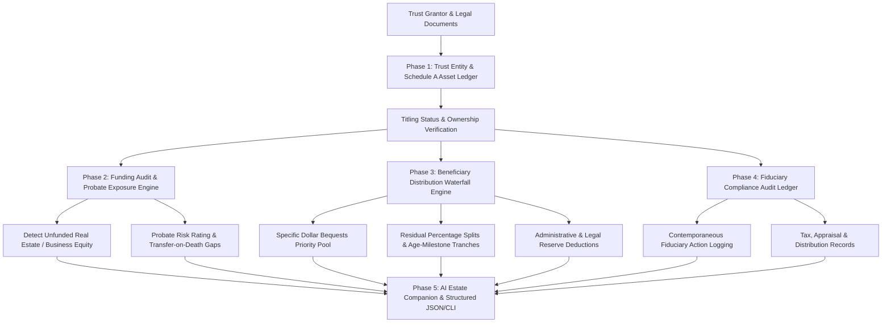

<div align="center">
  <div>&nbsp;</div>
  <h1>🏛️ trustguard-core</h1>
  <p><strong>Local-First Estate Planning & Trust Fiduciary Ledger, Beneficiary Waterfall Engine & AI Estate Companion</strong></p>

  [](https://github.com/Muybi3n/AI_Projects/actions)
  [](#)
  [](https://github.com/astral-sh/ruff)
  [](LICENSE)
  [](#)
</div>

---

> **⚠️ NOTE:** This project is for **Proof of Concept (POC)** and estate asset modeling purposes only. It is **NOT legal, estate planning, fiduciary, tax, or accounting advice**. Always review your estate planning documents with a licensed attorney and estate planning specialist.

---

## 📌 Overview

Estate planning and trust administration suffer from significant administrative failures:
* **The "Unfunded Trust" Trap:** Grantors establish Revocable Living Trusts, but fail to re-title deeds, LLC equity, or brokerage accounts to the trust—inadvertently throwing millions of dollars into lengthy, costly **probate court** proceedings.
* **Ambiguous Beneficiary Distribution:** Splitting complex estates across specific bequests, percentage residual pools, and age-milestone releases (e.g. 25%/30%/35% tranches) without deterministic simulation.
* **Trustee Liability & Fiduciary Exposure:** Successor trustees face personal liability if they fail to maintain contemporaneous accounting ledgers or breach statutory duties of loyalty, prudence, and impartiality.

**`trustguard-core`** is an offline, privacy-first fiduciary operating system designed to manage Trust Schedule A asset titling, simulate multi-tier beneficiary waterfalls, track immutable fiduciary compliance logs, and provide an AI Estate Companion for plain-English estate administration queries.

---

## 🏗️ Architecture & Fiduciary Workflow



---

## 🚀 Key Features

* **🔒 100% Local-First & Zero Cloud Retention:** All trust records, asset valuations, and beneficiary details remain encrypted and stored locally in `~/.trustguard/`. Zero third-party cloud data leakage.
* **🛡️ Titling & Probate Risk Detector:** Identifies assets titled in personal names rather than trust ownership, highlighting statutory probate exposures before grantor incapacity or death.
* **💧 Multi-Tier Beneficiary Waterfall Simulator:** Accurately models specific dollar bequests, percentage residual pools, and staggered age-milestone releases (e.g., 33% at age 25, 33% at 30, 34% at 35).
* **📜 Immutable Fiduciary Audit Trail:** Allows trustees to record appraisals, tax filings, asset re-titlings, and distributions with supporting document hashes to protect against beneficiary disputes.
* **🤖 Pluggable AI Estate Companion:** Ingests PII-sanitized estate state to answer complex estate questions (*"What assets are at risk of probate?"*, *"How is the estate divided if valuation changes to $3M?"*) using local LLMs (Ollama / vLLM) or custom cloud endpoints.

---

## 🌟 30-Second Beginner Quickstart

Get up and running in 3 copy-paste steps:

```bash
# 1. Install trustguard
pip install -e .

# 2. Initialize your family trust and add a property
trustguard init --name "The Henderson Family Revocable Living Trust" --grantor "Robert Henderson"
trustguard asset add --name "Primary Home" --category real_estate --value 850000 --titling titled_to_trust
trustguard asset add --name "Startup LLC" --category business_equity_llc --value 250000 --titling unfunded_probate_risk

# 3. Audit probate court risk and ask the AI companion
trustguard asset audit
trustguard ask "What assets are at risk of probate?"
```

---

## 🛠️ Step-by-Step Implementation Guide

### Phase 1: Installation & Setup

```bash
# Clone repository
git clone https://github.com/Muybi3n/AI_Projects.git
cd AI_Projects

# Install in editable mode
pip install -e .
```

### Phase 2: Initializing the Trust Entity

```bash
trustguard init \
  --name "The Harrison Family Revocable Living Trust" \
  --type revocable_living \
  --state Delaware \
  --grantor "Arthur Harrison" \
  --trustee "Arthur Harrison" \
  --successor "Elena Harrison"
```

### Phase 3: Populating Schedule A Assets & Auditing Probate Exposure

```bash
# Add properly titled assets
trustguard asset add --name "Primary Residence (Austin)" --category real_estate --value 950000 --titling titled_to_trust
trustguard asset add --name "Vanguard Brokerage" --category brokerage_account --value 650000 --titling titled_to_trust

# Add unfunded asset (probate vulnerability)
trustguard asset add --name "Tech Startup LLC Equity" --category business_equity_llc --value 400000 --titling unfunded_probate_risk

# Run probate audit
trustguard asset audit
```

**Example Audit Output:**
```text
======================================================================
                 TRUST FUNDING & PROBATE AUDIT                    
======================================================================
  Gross Estate Valuation       :  $2,000,000.00
  Formally Titled to Trust     :  $1,600,000.00 (80.0%)
  Direct Beneficiary Designated:          $0.00
  Unfunded / At-Risk Probate   :    $400,000.00 (20.0%)
──────────────────────────────────────────────────────────────────────
  Probate Risk Tier            : Moderate (Substantial Assets Require Pour-Over Will)
======================================================================

⚠️  AT-RISK ASSETS REQUIRING RETITLING OR TOD/POD DESIGNATION:
  • Tech Startup LLC Equity   : $400,000.00 (unfunded_probate_risk)
```

### Phase 4: Setting Beneficiary Rules & Running Waterfall Simulation

```bash
# Add specific bequest to charity
trustguard beneficiary add --name "St. Jude Children's Research" --relationship charity --specific-amount 50000 --scheme specific_dollar_bequest

# Add residual beneficiaries (50% each)
trustguard beneficiary add --name "Lucas Harrison" --relationship child --pct 50.0 --scheme outright_percentage
trustguard beneficiary add --name "Sophia Harrison" --relationship child --pct 50.0 --scheme age_milestone_tranches

# Run distribution waterfall
trustguard waterfall --admin-reserve-pct 2.0
```

**Example Waterfall Output:**
```text
======================================================================
                 BENEFICIARY DISTRIBUTION WATERFALL               
======================================================================
  Gross Estate Valuation       :  $2,000,000.00
  Admin/Legal Reserve (2.0%)   :     -$40,000.00
  Net Distributable Estate     :  $1,960,000.00
──────────────────────────────────────────────────────────────────────
  BENEFICIARY ALLOCATIONS:
  • St. Jude Children's Research:    $50,000.00 ( 2.6%) [Immediate:    $50,000.00]
  • Lucas Harrison             :   $955,000.00 (50.0%) [Immediate:   $955,000.00]
  • Sophia Harrison            :   $955,000.00 (50.0%) [Immediate:   $955,000.00]
======================================================================
```

### Phase 5: Querying the AI Estate & Fiduciary Companion

```bash
trustguard ask "What steps must the trustee take to avoid probate?"
```

**Example AI Companion Output:**
```text
━━━━━━━━━━━━━━━━━━━━━━━━━━━━━━━━━━━━━━━━━━━━━━━━━━━━━━━━━━━━━━━━━━━━━━
🤖 AI ESTATE & FIDUCIARY COMPANION: 'What steps must the trustee take to avoid probate?'
━━━━━━━━━━━━━━━━━━━━━━━━━━━━━━━━━━━━━━━━━━━━━━━━━━━━━━━━━━━━━━━━━━━━━━

🎯 EXECUTIVE SUMMARY:
Estate holds $2,000,000.00 in total assets across Schedule A. Funding status is rated
'Moderate' with 20.0% ($400,000.00) at risk of probate court delays.

🚨 PROBATE / TITLING RISKS:
  • Asset 'Tech Startup LLC Equity' ($400,000.00) is not titled to the trust and relies on pour-over will.

⚡ RECOMMENDED FIDUCIARY ACTIONS:
  • Execute deed transfer / change of ownership to formally re-title real estate or LLC equity into the Trust.
  • Update financial institution Transfer on Death (TOD) / Pay on Death (POD) beneficiary designations.

⚖️ STATUTORY REFERENCE: Uniform Probate Code (UPC) § 6-101; Restatement (Third) of Trusts § 86.
━━━━━━━━━━━━━━━━━━━━━━━━━━━━━━━━━━━━━━━━━━━━━━━━━━━━━━━━━━━━━━━━━━━━━━
```

---

## 🔒 Security & Fiduciary Privacy

* **Zero Hardcoded Secrets:** Does not store unencrypted private keys, passwords, or SSNs.
* **PII Sanitized:** Automatically scrubs personal identifiers before presenting context to AI engines.

---

## ⚖️ Disclaimer of Liability & Legal Notice

### 1. Not Legal, Estate Planning, or Tax Advice
This software, source code, CLI utilities, and AI outputs are provided strictly for **informational, educational, and Proof of Concept (POC) exploratory modeling purposes**. Nothing contained in this codebase or generated by `trustguard-core` constitutes legal advice, estate planning counsel, statutory interpretation, fiduciary representation, or tax advice.

### 2. No Attorney-Client or Fiduciary Relationship
Use of this software does not create an attorney-client relationship, fiduciary relationship, or professional service contract between you and the authors or contributors.

### 3. Limitation of Liability & "AS IS" Warranty
THE SOFTWARE IS PROVIDED "AS IS", WITHOUT WARRANTY OF ANY KIND, EXPRESS OR IMPLIED, INCLUDING BUT NOT LIMITED TO THE WARRANTIES OF MERCHANTABILITY, FITNESS FOR A PARTICULAR PURPOSE, AND NONINFRINGEMENT.

IN NO EVENT SHALL THE AUTHORS, MAINTAINERS, CONTRIBUTORS, OR COPYRIGHT HOLDERS BE LIABLE FOR ANY CLAIM, DAMAGES, PROBATE FEES, ESTATE TAX PENALTIES, WILL CONTEST LOSSES, LITIGATION EXPENSES, OR OTHER LIABILITY—WHETHER IN AN ACTION OF CONTRACT, TORT (INCLUDING NEGLIGENCE), STRICT LIABILITY, OR OTHERWISE—ARISING FROM, OUT OF, OR IN CONNECTION WITH THE SOFTWARE, OR THE USE OR INABILITY TO USE THE SOFTWARE.

### 4. User Assumption of Risk
Estate laws and probate procedures vary significantly across jurisdictions. You expressly agree that you are solely responsible for verifying all trust instruments, deeds, titling schedules, and distribution plans with a licensed trusts and estates attorney and Certified Public Accountant (CPA) in your governing jurisdiction.

---

## 📜 Trademarks & Licensing

All product names, statutory references, and legal standards mentioned in documentation are for educational, identification, and descriptive purposes only.

This project is licensed under the [MIT License](LICENSE).
