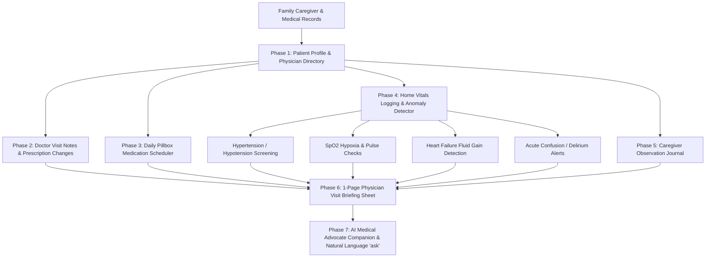

<div align="center">
  <div>&nbsp;</div>
  <h1>❤️ careguard-core</h1>
  <p><strong>Family Caregiver Medical Record Tracker, Multi-Doctor Coordinator & AI Clinical Briefing Engine</strong></p>

  [](https://github.com/Muybi3n/AI_Projects/actions)
  [](#)
  [](https://github.com/astral-sh/ruff)
  [](LICENSE)
  [](#)
</div>

---

> **🚨 CRITICAL MEDICAL EMERGENCY DISCLAIMER:** This project is strictly for **informational, care coordination, record tracking, and family advocacy purposes**. It is **NOT clinical medical advice or diagnosis**. In any medical emergency, call **911 or your local emergency response service immediately**.

---

## 📌 Overview

Caring for an aging, sick, or vulnerable family member involves overwhelming medical complexity:
* **The "Too Many Specialists" Trap:** Juggling cardiologists, neurologists, oncologists, nephrologists, and primary care physicians who rarely communicate seamlessly.
* **Medication Chaos:** Constant dosage adjustments, conflicting prescriptions, morning/evening pillbox administration confusion, and missed doses.
* **Missed Warning Signals:** Subtle vital sign red flags (rapid fluid weight gain in heart failure, drops in oxygen SpO2, blood pressure spikes, sudden confusion or delirium) that go unnoticed until emergency hospitalization.
* **Rushed 15-Minute Doctor Visits:** Arriving at specialist appointments without organized records, forgetting critical symptoms, and missing opportunities to ask vital questions.

**`careguard-core`** is an offline, privacy-first medical operating system and family caregiving journal designed to centralize multi-doctor visit notes, manage daily pillbox schedules, flag vitals anomalies, and generate a **1-page printable Clinical Briefing Sheet** for doctor appointments.

---

## 🏗️ Architecture & Caregiving Workflow



---

## 🚀 Key Features

* **🔒 100% Local-First & Zero Cloud Leakage:** All medical history, doctor notes, and vitals logs are stored locally in `~/.careguard/`. Zero cloud transmission or data selling.
* **🩺 Multi-Doctor & Specialist Coordinator:** Tracks past appointment findings, medication changes ordered, requested lab/imaging orders, and follow-up dates across all providers.
* **💊 4-Slot Daily Pillbox Organizer:** Groups active prescriptions into Morning, Noon, Evening, Bedtime, and As-Needed administration slots.
* **🚨 Vitals Anomaly & Safety Scanner:** Automatically detects dangerous physiological deviations (SpO2 < 92%, BP > 180/120, >3 lb rapid fluid gain, cognitive confusion).
* **📋 1-Page Doctor Visit Briefing Sheet (`careguard brief`):** Formats a clean clinical prep sheet to hand directly to doctors at the beginning of an appointment.
* **🤖 Pluggable AI Medical Advocate (`careguard ask`):** Summarizes complex medical history and suggests focused discussion questions for specialists using offline reasoning or local/cloud LLMs.

---

## 🌟 30-Second Beginner Quickstart

Get up and running in 3 copy-paste steps:

```bash
# 1. Install careguard
pip install -e .

# 2. Initialize profile and add your family member's doctor & medication
careguard init --name "Eleanor Vance" --relationship "Mother" --birth-year 1948 --diagnoses "Congestive Heart Failure, Hypertension"
careguard doctor add --name "Dr. Robert Klein" --specialty "Cardiology" --phone "555-0144"
careguard med add --name "Furosemide" --dosage "40mg" --slot "morning" --purpose "Fluid control"

# 3. Log daily vitals, generate a doctor visit briefing, and ask the AI companion
careguard vitals add --sys 124 --dia 80 --hr 68 --spo2 97.5 --weight 138.5
careguard brief
careguard ask "Prepare questions for tomorrow's cardiologist appointment"
```

---

## 🛠️ Step-by-Step Implementation Guide

### Phase 1: Installation & Setup

```bash
# Clone the repository
git clone https://github.com/Muybi3n/AI_Projects.git
cd AI_Projects

# Switch to careguard-core branch and install
git checkout careguard-core
pip install -e .
```

### Phase 2: Building the Physician Directory & Logging Appointments

```bash
# Add doctors
careguard doctor add --name "Dr. Sarah Chen" --specialty "Neurology" --clinic "University Medical"
careguard doctor add --name "Dr. Robert Klein" --specialty "Cardiology" --clinic "Heart Institute"

# Record a completed doctor visit
careguard visit add \
  --doctor "Dr. Robert Klein" \
  --specialty "Cardiology" \
  --findings "Ejection fraction stable at 45%. Mild bilateral lower extremity edema." \
  --changes "Increased Furosemide to 40mg daily." \
  --follow-up "2026-11-15"
```

### Phase 3: Managing the Daily Pillbox Regimen

```bash
# Add medications with designated timing slots
careguard med add --name "Furosemide" --dosage "40mg" --slot morning --purpose "Diuretic / Fluid" --instructions "Take with breakfast"
careguard med add --name "Metoprolol Succinate" --dosage "50mg" --slot morning --purpose "Heart rate / BP"
careguard med add --name "Atorvastatin" --dosage "20mg" --slot bedtime --purpose "Cholesterol"

# View full 4-slot daily pillbox schedule
careguard med schedule
```

**Example Pillbox Output:**
```text
======================================================================
           DAILY PILLBOX SCHEDULE FOR ELEANOR VANCE           
======================================================================

⏰ MORNING SLOT (2 items):
   • Furosemide (40mg) - Diuretic / Fluid [Take with breakfast]
   • Metoprolol Succinate (50mg) - Heart rate / BP

⏰ BEDTIME SLOT (1 items):
   • Atorvastatin (20mg) - Cholesterol
======================================================================
```

### Phase 4: Logging Daily Vitals & Scanning for Red-Flag Anomalies

```bash
# Log morning vitals
careguard vitals add --sys 185 --dia 110 --hr 92 --spo2 90.5 --weight 142.5 --confusion --notes "Mom felt dizzy getting out of bed."

# Run safety audit
careguard vitals audit
```

**Example Vitals Audit Output:**
```text
===========================================================================
            VITALS ANOMALY & SAFETY AUDIT (Eleanor Vance)           
===========================================================================

🚨 [URGENT_ATTENTION] Blood Pressure = 185/110 mmHg
   Clinical  : Hypertensive crisis threshold (>180/120 mmHg). Evaluate for emergency care.

🚨 [URGENT_ATTENTION] Oxygen Saturation (SpO2) = 90.5%
   Clinical  : Hypoxia threshold (<92% SpO2). Check supplemental oxygen.

🚨 [WARNING] Weight Gain (Fluid Retention) = +4.0 lbs
   Clinical  : Rapid weight gain (>3 lbs). Possible heart failure fluid exacerbation.
===========================================================================
```

### Phase 5: Generating 1-Page Physician Visit Briefing Sheet

```bash
careguard brief
```

**Example Visit Briefing Output:**
```text
===========================================================================
               CLINICAL APPOINTMENT BRIEFING SHEET               
===========================================================================
  PATIENT          : Eleanor Vance (Age 78 | Mother)
  PRIMARY DIAGNOSES: Congestive Heart Failure, Hypertension
  ALLERGIES        : Penicillin
  CODE STATUS      : POLST
───────────────────────────────────────────────────────────────────────────
  RECENT HOME VITALS (Past 7 Days):
    • Avg blood pressure     : 135/85 mmHg
    • Avg heart rate         : 72 bpm
    • Avg spo2               : 96.2%
───────────────────────────────────────────────────────────────────────────
  ACTIVE MEDICATIONS (3 items):
    • Furosemide             40mg     [morning] - Diuretic / Fluid
    • Metoprolol Succinate   50mg     [morning] - Heart rate / BP
    • Atorvastatin           20mg     [bedtime] - Cholesterol
───────────────────────────────────────────────────────────────────────────
  PRIORITIZED DISCUSSION POINTS FOR DOCTOR:
    [ ] Review recent vitals deviations flagged in the home monitoring log.
    [ ] Evaluate recent episodes of confusion/memory fog for underlying causes.
    [ ] Review complete medication roster to verify if any dosages can be simplified.
===========================================================================
```

### Phase 6: Querying the AI Caregiver Medical Advocate

```bash
careguard ask "Summarize what the cardiologist changed and what questions we need to ask."
```

**Example AI Companion Output:**
```text
━━━━━━━━━━━━━━━━━━━━━━━━━━━━━━━━━━━━━━━━━━━━━━━━━━━━━━━━━━━━━━━━━━━━━━━━━━━
🤖 AI CAREGIVER MEDICAL ADVOCATE: 'Summarize what the cardiologist changed...'
━━━━━━━━━━━━━━━━━━━━━━━━━━━━━━━━━━━━━━━━━━━━━━━━━━━━━━━━━━━━━━━━━━━━━━━━━━━

🎯 ADVOCATE SUMMARY:
Preparation briefing for Mother (Age 78), diagnosed with Congestive Heart Failure, 
Hypertension. Total active medications: 3.

🩺 DOCTOR VISIT & MEDICATION TAKEAWAYS:
  • Last Visit (2026-09-10 - Cardiology): Ejection fraction stable at 45%. Mild lower extremity edema.
  • Changes Ordered: Increased Furosemide to 40mg daily.

📋 QUESTIONS FOR THE DOCTOR / SPECIALIST:
  • Are current medication dosages aligned with recent renal and metabolic function?
  • What specific symptoms should prompt an immediate call to your clinic vs an ER visit?

⚡ CAREGIVER ACTION PLAN:
  • Print or export 'careguard brief' to hand directly to the physician at the appointment.
━━━━━━━━━━━━━━━━━━━━━━━━━━━━━━━━━━━━━━━━━━━━━━━━━━━━━━━━━━━━━━━━━━━━━━━━━━━
```

---

## 🔒 Privacy & Local-First Security

* **Zero Cloud Data Transmission:** All family health records stay entirely on your local filesystem.
* **PII Scrubber:** Automatically strips street addresses, telephone numbers, and government IDs before presenting context to AI models.

---

## ⚖️ Disclaimer of Liability & Clinical Notice

### 1. Not Medical, Diagnostic, or Emergency Advice
This software and all associated documentation, algorithms, and AI outputs are provided strictly for **informational, tracking, educational, and family caregiving coordination purposes**. Nothing contained in this codebase or generated by `careguard-core` constitutes medical advice, clinical diagnosis, or emergency triage.

### 2. No Doctor-Patient Relationship
Use of this software does not establish a physician-patient or healthcare provider relationship between you, your care recipient, and the authors or contributors.

### 3. Limitation of Liability & "AS IS" Warranty
THE SOFTWARE IS PROVIDED "AS IS", WITHOUT WARRANTY OF ANY KIND, EXPRESS OR IMPLIED. IN NO EVENT SHALL THE AUTHORS, MAINTAINERS, CONTRIBUTORS, OR COPYRIGHT HOLDERS BE LIABLE FOR ANY CLAIM, DAMAGES, MEDICAL COMPLICATIONS, ADVERSE DRUG REACTIONS, DELAYED EMERGENCY CARE, OR OTHER LIABILITY ARISING FROM THE USE OF THIS SOFTWARE.

### 4. User Assumption of Risk & Emergency Procedures
You expressly agree that caregiving and medical management carry inherent health risks. You are solely responsible for verifying all medication schedules, dosage instructions, and vitals readings with licensed physicians. **IN ANY ACUTE MEDICAL CRISIS, CALL 911 OR GO TO THE NEAREST EMERGENCY ROOM IMMEDIATELY.**

---

## 📜 Trademarks & Licensing

All brand and clinic names referenced in examples or benchmarks are property of their respective trademark holders. Use of these names is for identification, compatibility, and descriptive purposes only.

This project is licensed under the [MIT License](LICENSE).
