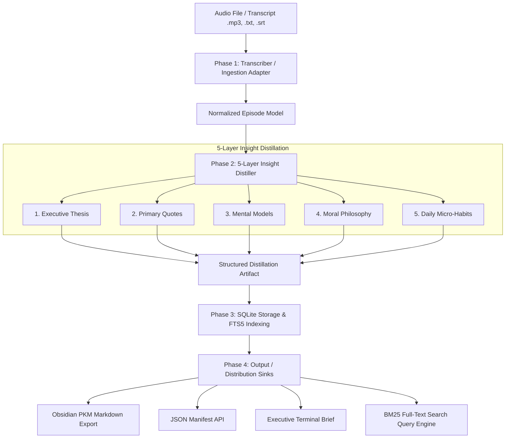

<div align="center">
  <div>&nbsp;</div>
  <h1>🎙️ lexicast-engine</h1>
  <p><strong>Local-First Audio Ingestion & 5-Layer Structured Insight Distillation Pipeline with SQLite FTS5 Search</strong></p>

  [](https://github.com/Muybi3n/AI_Projects/actions)
  [](#)
  [](https://github.com/astral-sh/ruff)
  [](LICENSE)
  [](#)
</div>

---

> **⚠️ NOTE:** This project is for **Proof of Concept (POC)** and exploratory knowledge engineering purposes. It is not intended as commercial medical, financial, or legal advice.

---

## 📌 Overview

Long-form podcasts, executive lectures, and recorded technical interviews contain dense, life-changing knowledge. However, listening to 2–3 hour recordings repeatedly is inefficient, and conventional generic LLM summaries produce superficial, unhelpful bullet points.

**`lexicast-engine`** provides a privacy-first, local pipeline that ingests audio recordings and transcripts, transforms raw dialogue into a structured **5-Layer Distillation Protocol**, and indexes every concept into a local **SQLite FTS5 (Full-Text Search)** knowledge repository.

### The 5-Layer Distillation Protocol:
1. 🎯 **Executive Thesis & Context:** 1–2 sentence high-altitude summary of the conversation's core premise.
2. 💬 **Unabridged Primary Quotes:** Verbatim key statements preserved with full semantic impact.
3. 🧠 **Mental Models & First Principles:** Underlying cognitive frameworks (e.g., *Inversion, Feedback Loops, Asymmetric Risk*).
4. ⚖️ **Moral & Philosophical Lessons:** High-EQ life wisdom, character development, and strategic reflection.
5. ⚡ **Actionable Daily Micro-Habits:** Concrete, granular behavioral steps to apply immediately.

---

## 🏗️ Architecture & Pipeline Flow



---

## 🚀 Key Features

* **🔒 Local-First & Zero Cloud Retention:** Works completely offline. Transcripts and extracted knowledge remain on your machine.
* **🔎 Lightning-Fast BM25 Search:** Built-in SQLite FTS5 virtual table enables sub-millisecond keyword and conceptual searches across all indexed episodes.
* **📝 Obsidian & PKM Ready:** Auto-exports Markdown notes with YAML frontmatter, tags, task checklists (`- [ ]`), and collapsible transcript drawers.
* **🧠 Pluggable LLM Extraction:** Includes a robust offline heuristic extractor with zero dependencies, plus a pluggable prompt adapter for Ollama, OpenAI-compatible local servers, or cloud LLMs.
* **⚡ Daily Executive Briefs:** Instant one-screen formatted briefings for terminal consumption or automated messaging hooks.

---

## 🛠️ Step-by-Step Implementation Guide

### Phase 1: Installation & Setup

```bash
# Clone the repository
git clone https://github.com/Muybi3n/AI_Projects.git
cd AI_Projects

# Install in editable mode with development dependencies
pip install -e .
```

### Phase 2: Ingesting & Distilling Transcripts

```bash
# Ingest and distill a transcript file in one command
lexicast ingest interview.txt --title "Systems and Discipline" --speaker "Jocko Willink" --distill

# Ingest an SRT subtitle file
lexicast ingest recording.srt --speaker "Andrew Huberman" --distill
```

### Phase 3: Searching Knowledge with SQLite FTS5

```bash
# Search across all indexed quotes, mental models, and transcripts
lexicast search "discipline"

# Search for specific cognitive frameworks
lexicast search "feedback loops"
```

**Example Terminal Search Output:**
```text
Search results for 'discipline' (1 hit(s)):
────────────────────────────────────────────────────────────
• [3f8a12bc] Systems and Discipline (Speaker: Jocko Willink)
  Snippet: ...[MATCH]Discipline[/MATCH] equals freedom. Focus on daily consistency...
```

### Phase 4: Generating Daily Executive Briefs

```bash
lexicast brief 3f8a12bc
```

**Example Brief Output:**
```text
━━━━━━━━━━━━━━━━━━━━━━━━━━━━━━━━━━━━━━━━━━━━━━━━━━━━━
🎙️ SYSTEMS AND DISCIPLINE
Speaker: Jocko Willink | ID: 3f8a12bc
━━━━━━━━━━━━━━━━━━━━━━━━━━━━━━━━━━━━━━━━━━━━━━━━━━━━━
🎯 CORE THESIS:
Building great systems requires thinking in feedback loops and first principles.

💬 KEY QUOTE:
"You do not rise to the level of your goals, you fall to the level of your systems."

🧠 MENTAL MODELS:
First Principles, Inversion, Compounding

⚖️ MORAL LESSON:
Consistency and deliberate effort compound over time into mastery.

⚡ ACTIONABLE HABITS:
  • Start tracking your habits every morning in a journal.
  • Focus on eliminating distractions.
━━━━━━━━━━━━━━━━━━━━━━━━━━━━━━━━━━━━━━━━━━━━━━━━━━━━━
```

### Phase 5: Exporting to Obsidian / Markdown / JSON

```bash
# Export formatted Markdown note for Obsidian vault
lexicast export 3f8a12bc --format md --out ~/vault/notes/systems_and_discipline.md

# Export structured JSON
lexicast export 3f8a12bc --format json --out episode_data.json
```

---

## 🔒 Security & IP Governance

* **Zero Hardcoded Secrets:** Contains no API keys, cloud credentials, or sensitive tokens.
* **Privacy-Preserving:** Operates on local storage (`~/.lexicast/lexicast.db`).

---

## ⚖️ Trademarks & Licensing

All product names, logos, and brands referenced in documentation are property of their respective owners. Use of these names is for identification and descriptive purposes only and does not imply endorsement.

This project is licensed under the [MIT License](LICENSE).
