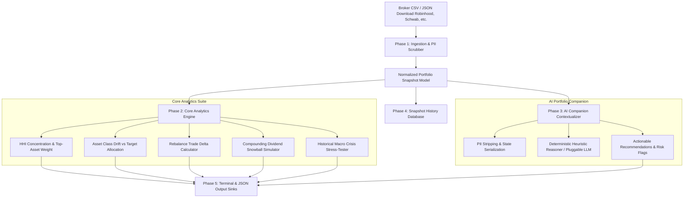

<div align="center">
  <div>&nbsp;</div>
  <h1>🧭 capdrift-engine</h1>
  <p><strong>Local-First Portfolio Analytics, Capital Drift Auditor, Dividend Snowball Simulator & AI Investment Companion</strong></p>

  [](https://github.com/Muybi3n/AI_Projects/actions)
  [](#)
  [](https://github.com/astral-sh/ruff)
  [](LICENSE)
  [](#)
</div>

---

> **⚠️ NOTE:** This project is for **Proof of Concept (POC)** and personal financial modeling purposes only. It is not licensed investment, financial, tax, or legal advice. Always verify calculations before making portfolio trades or capital allocation decisions.

---

## 📌 Overview

Retail brokerage apps and trackers frequently fail active long-term investors in several key areas: they encourage compulsive day-trading, monetize order flows and personal transaction data, or display superficial charts without meaningful risk diagnostics.

**`capdrift-engine`** is an offline, privacy-first portfolio companion. Users periodically download their raw portfolio holdings (from brokers like Robinhood, Schwab, Fidelity, Vanguard, or generic CSVs) and run deep, actionable analytics:

### What Makes It Meaningful (Beyond Basic Trackers):
1. 🎯 **Concentration Risk & HHI Scoring:** Measures portfolio concentration using the **Herfindahl-Hirschman Index (HHI)** to detect hidden single-stock or idiosyncratic risks before drawdowns occur.
2. ⚖️ **Capital Drift & Rebalancing Engine:** Compares current asset allocations against custom benchmarks (e.g., Core 4, 60/40, Boglehead) and outputs exact dollar deltas to buy/trim to restore balance.
3. ❄️ **Dividend Snowball Compounding:** Projects multi-year compounding cash flow trajectories with automated Dividend Reinvestment (DRIP) modeling.
4. 🚨 **Historical Macro Stress-Testing:** Simulates portfolio drawdowns against major market crises (2008 Global Financial Crisis, 2020 COVID Flash Crash, 2022 Tech Rate Shock).
5. 🤖 **Pluggable AI Investment Companion:** Ingests PII-sanitized portfolio state to answer complex natural-language questions (*"Where is my biggest uncompensated risk?"*, *"What happens to my dividends if tech pulls back 20%?"*) using local LLMs (Ollama / vLLM) or custom cloud endpoints.

---

## 🏗️ Architecture & Analysis Flow



---

## 🚀 Key Features

* **🔒 100% Local-First & Zero Cloud Retention:** Ingests raw CSV/JSON files and stores snapshots locally in `~/.capdrift/`. Zero brokerage account credentials, zero API scraping tokens.
* **🛡️ Universal Broker Compatibility:** Auto-detects column headers from Robinhood, Charles Schwab, Fidelity, Vanguard, or generic CSV formats.
* **🤖 Pluggable AI Investment Companion:** Ask natural-language portfolio questions directly from your terminal. Works 100% offline out-of-the-box or connects to your custom local/cloud LLM.
* **📊 Quantitative Rebalancing:** Generates exact buy/trim dollar amounts to systematically buy low and sell high without emotional bias.
* **📦 Zero Dependencies:** Core analytics, ingestion, and storage engine built purely on standard library Python 3.10+.

---

## 🌟 30-Second Beginner Quickstart

Get up and running in 3 copy-paste steps:

```bash
# 1. Install capdrift
pip install -e .

# 2. Ingest your downloaded broker CSV (Robinhood, Schwab, Fidelity, etc.)
capdrift ingest portfolio.csv --broker Robinhood

# 3. Run a complete health audit and ask the AI companion
capdrift audit
capdrift ask "Where is my biggest concentration risk?"
```

---

## 🛠️ Step-by-Step Implementation Guide

### Phase 1: Installation & Setup

```bash
# Clone the repository
git clone https://github.com/Muybi3n/AI_Projects.git
cd AI_Projects

# Install in editable mode
pip install -e .
```

### Phase 2: Ingesting a Brokerage Export

Download your portfolio holdings CSV from your broker (e.g. Robinhood account statement or holdings export) and ingest it:

```bash
# Ingest downloaded CSV
capdrift ingest portfolio.csv --broker Robinhood
```

**Example Ingest Output:**
```text
[✓] Ingested Snapshot: 12 holdings | Total Equity: $48,250.00 [ID: 9a2f14bc]
```

### Phase 3: Running a Comprehensive Portfolio Audit

```bash
capdrift audit
```

**Example Audit Output:**
```text
=================================================================
                    PORTFOLIO HEALTH AUDIT                       
=================================================================
  Total Portfolio Equity   :     $48,250.00
  Total Cost Basis         :     $39,100.00
  Unrealized Gain/Loss     :     +$9,150.00 (+23.4%)
  Annual Dividend Income   :        $820.50 (1.70% Yield)
  Unallocated Cash Balance :      $2,500.00
─────────────────────────────────────────────────────────────────
  Concentration HHI Score  : 1840.2 (Moderately Concentrated)
  Top Asset (VOO) Weight   : 34.2% (Top 3: 68.5%)
=================================================================

--- Asset Allocation Breakdown vs Baseline ---
  • us_equities     :  68.4%  (Target:  60.0% | Drift:  +8.4%)
  • intl_equities   :  14.2%  (Target:  20.0% | Drift:  -5.8%)
  • fixed_income    :   8.5%  (Target:  10.0% | Drift:  -1.5%)
  • crypto          :   3.7%  (Target:   5.0% | Drift:  -1.3%)
  • cash            :   5.2%  (Target:   5.0% | Drift:  +0.2%)
```

### Phase 4: Calculating Rebalancing Trade Deltas

```bash
# Calculate trades to restore target allocation
capdrift rebalance --target "us_equities:60,intl_equities:20,fixed_income:10,crypto:5,cash:5"
```

**Example Rebalance Output:**
```text
=================================================================
                    REBALANCING TRADE DELTAS                     
=================================================================
  [TRIM / HARVEST] us_equities     -$4,053.00 (Drift: +8.4%)
  [BUY / ALLOCATE] intl_equities   +$2,798.50 (Drift: -5.8%)
  [BUY / ALLOCATE] fixed_income      +$724.50 (Drift: -1.5%)
  [BUY / ALLOCATE] crypto            +$627.25 (Drift: -1.3%)
  [BALANCED      ] cash               -$96.50 (Drift: +0.2%)
=================================================================
```

### Phase 5: Simulating Historical Crash Stress-Tests

```bash
capdrift stress-test
```

**Example Stress-Test Output:**
```text
=================================================================
             HISTORICAL MACRO CRASH STRESS-TESTS                 
=================================================================

🚨 2008 Global Financial Crisis (GFC)
   Context             : Severe liquidity & banking collapse, credit freeze.
   Projected Drawdown  : -44.8% (-$21,616.00)
   Estimated Recovery  : 3.5 - 4.5 Years

🚨 2020 COVID Flash Crash
   Context             : Rapid global lockdown shock followed by monetary stimulus.
   Projected Drawdown  : -29.6% (-$14,282.00)
   Estimated Recovery  : 5 - 6 Months

🚨 2022 Fed Rate Hike & Tech Drawdown
   Context             : Aggressive quantitative tightening and multiple compression.
   Projected Drawdown  : -19.4% (-$9,360.50)
   Estimated Recovery  : 1.5 - 2 Years
=================================================================
```

### Phase 6: Querying the AI Investment Companion

```bash
capdrift ask "Where is my biggest uncompensated risk?"
```

**Example AI Companion Output:**
```text
━━━━━━━━━━━━━━━━━━━━━━━━━━━━━━━━━━━━━━━━━━━━━━━━━━━━━━━━━━━━━━━━━
🤖 AI PORTFOLIO COMPANION: 'Where is my biggest uncompensated risk?'
━━━━━━━━━━━━━━━━━━━━━━━━━━━━━━━━━━━━━━━━━━━━━━━━━━━━━━━━━━━━━━━━━

🎯 EXECUTIVE THESIS:
Portfolio holds $48,250.00 in total equity with an HHI concentration score of 
1840.2 (Moderately Concentrated). Top holding 'VOO' represents 34.2% of total capital.

🔍 OBSERVATIONS:
  • Top 3 assets comprise 68.5% of overall portfolio weight.
  • Concentration levels remain balanced across broad market holdings.

⚡ RECOMMENDED ACTIONS:
  • Consider directing new capital into underweight international or fixed-income assets.

🌐 MACRO CONTEXT: Broad diversification insulates core capital from sector-specific multiple compression.
━━━━━━━━━━━━━━━━━━━━━━━━━━━━━━━━━━━━━━━━━━━━━━━━━━━━━━━━━━━━━━━━━
```

---

## 🔒 Security & Privacy

* **Zero Account Credentials:** No Plaid logins, brokerage passwords, or API tokens required.
* **PII Sanitized:** Automatically drops user identifying metadata before computing metrics or forwarding to LLM companions.

---

## ⚖️ Disclaimer of Liability & Limited Liability Notice

### 1. Not Investment, Financial, or Legal Advice
This software and all associated documentation, algorithms, and AI outputs are provided strictly for **informational, educational, and Proof of Concept (POC) exploratory modeling purposes**. Nothing contained in this codebase or generated by the application constitutes investment advice, financial planning, trading recommendations, legal counsel, or tax advice.

### 2. No Fiduciary Relationship
Use of this software does not create an investment advisor-client, fiduciary, or brokerage relationship between you and the authors or contributors of this project.

### 3. Limitation of Liability & "AS IS" Warranty
THE SOFTWARE IS PROVIDED "AS IS", WITHOUT WARRANTY OF ANY KIND, EXPRESS OR IMPLIED, INCLUDING BUT NOT LIMITED TO THE WARRANTIES OF MERCHANTABILITY, FITNESS FOR A PARTICULAR PURPOSE, AND NONINFRINGEMENT.

IN NO EVENT SHALL THE AUTHORS, MAINTAINERS, CONTRIBUTORS, OR COPYRIGHT HOLDERS BE LIABLE FOR ANY CLAIM, DAMAGES, OR OTHER LIABILITY—WHETHER IN AN ACTION OF CONTRACT, TORT (INCLUDING NEGLIGENCE), STRICT LIABILITY, OR OTHERWISE—ARISING FROM, OUT OF, OR IN CONNECTION WITH THE SOFTWARE, OR THE USE, INABILITY TO USE, OR OTHER DEALINGS IN THE SOFTWARE. THIS INCLUDES, WITHOUT LIMITATION, ANY DIRECT, INDIRECT, INCIDENTAL, SPECIAL, EXEMPLARY, PUNITIVE, OR CONSEQUENTIAL DAMAGES (INCLUDING LOSS OF CAPITAL, TRADING LOSSES, TAX PENALTIES, MARKET DRAWDOWN LOSSES, CALCULATION INACCURACIES, DATA LOSS, OR BUSINESS INTERRUPTION).

### 4. User Assumption of Risk
You expressly acknowledge and agree that your use of this software is at your sole risk. You are solely responsible for independently verifying all portfolio calculations, asset allocations, tax implications, and trade rebalancing numbers with a licensed financial advisor, Certified Financial Planner (CFP), or Certified Public Accountant (CPA) before executing any financial trades.

---

## 📜 Trademarks & Licensing

Robinhood, Charles Schwab, Fidelity, Vanguard, and all other product names, logos, and brands referenced in documentation or benchmarks are property of their respective trademark holders. Use of these names is for identification, compatibility, and descriptive purposes only and does not imply endorsement, sponsorship, or affiliation.

This project is licensed under the [MIT License](LICENSE).
