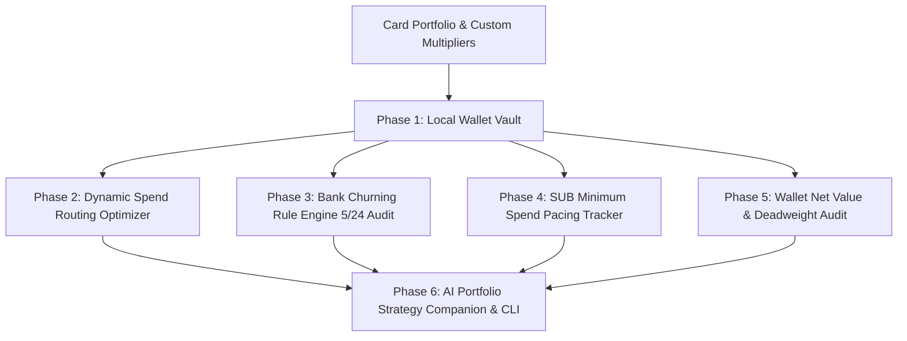

<div align="center">
  <div>&nbsp;</div>
  <h1>💳 cardroute-engine</h1>
  <p><strong>Credit Card Spend Routing Optimizer, Bank 5/24 Churning Rule Engine, SUB Minimum Spend Tracker & AI Portfolio Companion</strong></p>

  [](https://github.com/Muybi3n/AI_Projects/actions)
  [](#)
  [](https://github.com/astral-sh/ruff)
  [](LICENSE)
  [](#)
</div>

---

> **⚖️ LIMITED LIABILITY & NOT FINANCIAL ADVICE NOTICE:** This software and all associated documentation, algorithms, and AI outputs are provided strictly for **informational, educational, and personal optimization purposes**. Nothing contained in `cardroute-engine` constitutes financial advice, credit counseling, or bank endorsement. The user assumes full responsibility for all credit applications, annual fees, credit score impacts, and financial decisions.

---

## 📌 Overview

Credit card rewards enthusiasts and points maximizers face distinct friction points:
* **Sub-Optimal Merchant Routing:** Leaving 2% to 6% in points on the table by using the wrong card at checkout.
* **Bank Churning Rules & 5/24 Jail:** Applying for cards blindly without knowing your exact Chase 5/24 count, Amex once-per-lifetime restrictions, or Citi 8/65 timelines.
* **Missed Sign-Up Bonuses (SUBs):** Failing to meet Minimum Spend Requirements (e.g. $4,000 in 90 days) due to lack of daily burn-rate tracking.
* **Coupon Book Fatigue:** Forgetting monthly or semi-annual statement credits (dining credits, travel offsets) that justify high annual fees.

**`cardroute-engine`** is an offline, local-first CLI and optimization engine that routes transactions to the highest-yielding card in your wallet, audits bank eligibility rules, tracks SUB deadlines, and provides an AI Portfolio Companion for card churning strategies.

---

## 🏗️ Architecture



---

## 🌟 30-Second Beginner Quickstart

```bash
# 1. Install cardroute
pip install -e .

# 2. View your current card lineup and check Chase 5/24 status
cardroute list
cardroute 524

# 3. Find optimal card for checkout and ask the AI Companion
cardroute route --category dining --amount 125.0
cardroute ask "What card should I get next while I am under 5/24?"
```

---

## 🛠️ Step-by-Step CLI Workflows

### 1. Dynamic Purchase Routing

```bash
# Route a $200 grocery purchase
cardroute route --category groceries --amount 200.0
```

**Example Routing Output:**
```text
╔══════════════════════════════════════════════════════════════════╗
║               💳 CARDROUTE REWARDS & CHURNING ENGINE             ║
╚══════════════════════════════════════════════════════════════════╝
Purchase Context: $200.00 in GROCERIES
Strategy: SIGNUP_BONUS_PRIORITY

╭───────────────── 🎯 Optimal Checkout Decision ─────────────────╮
│ RECOMMENDED CARD: American Express Gold Card (Amex)            │
│ Reason: Active Sign-Up Bonus on Amex Gold: $3,150.00 remaining │
│ Multiplier: 4.0x Amex MR                                       │
│ Estimated Net Return: 23.0% ($46.00)                           │
╰────────────────────────────────────────────────────────────────╯
```

### 2. Auditing Bank Churning Rules (Chase 5/24)

```bash
cardroute 524
```

**Example Output:**
```text
Chase 5/24 Status: 3/24
Slots Available: 2
Chase Application Eligibility: Eligible for Chase personal & business cards
```

### 3. Tracking Sign-Up Bonus (SUB) Minimum Spend

```bash
# List all active SUB trackers
cardroute sub list

# Log spend toward a SUB
cardroute sub log --id amex-gold --amount 450.00
```

### 4. Auditing Net Annual Wallet Profit

```bash
cardroute audit
```

**Example Output:**
```text
===========================================================================
                     WALLET ANNUAL NET VALUE AUDIT                        
===========================================================================
  Gross Annual Fees       :   $420.00
  Statement Credits Offset: - $290.00
  Net Annual Fee Cost     :   $130.00
  Projected Rewards Value : + $1,485.00
───────────────────────────────────────────────────────────────────────────
  NET ANNUAL WALLET PROFIT :   $1,355.00
===========================================================================
```

---

## 🔒 Privacy & Local Storage Directives

* **100% Local File Storage:** All card details, credit lines, and spend profiles remain in `~/.cardroute/portfolio.json`.
* **Zero Cloud Tracking:** No banking credentials, account numbers, or personal identity numbers are ever stored or transmitted.

---

## 📜 License

This project is licensed under the [MIT License](LICENSE).
