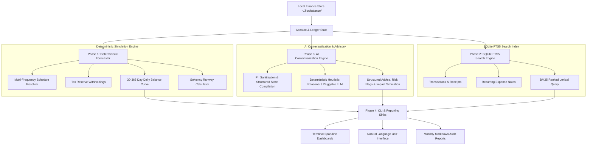

<div align="center">
  <div>&nbsp;</div>
  <h1>💰 flowbalance-core</h1>
  <p><strong>Deterministic Local-First Cash Flow Forecasting, AI Wealth Advisory & SQLite FTS5 Search Engine</strong></p>

  [](https://github.com/Muybi3n/AI_Projects/actions)
  [](#)
  [](https://github.com/astral-sh/ruff)
  [](LICENSE)
  [](#)
</div>

---

> **⚠️ NOTE:** This project is for **Proof of Concept (POC)** and personal financial modeling purposes only. It is not licensed financial, tax, or legal advice. Always verify calculations before making capital allocation decisions.

---

## 📌 Overview

Most personal finance apps suffer from significant flaws: they monetize private user transactions, require subscription lock-in, or only display backwards-looking historical charts without predictive forecasting.

**`flowbalance-core`** is a 100% offline personal finance engine that combines **deterministic forward cash flow simulation**, an **AI-powered Natural Language Financial Advisor**, and a sub-millisecond **SQLite FTS5 Full-Text Ledger Search**.

### Core Pillars:
1. 📈 **Deterministic Daily Trajectory:** Simulates forward cash balances over 30–365 days across irregular schedules (daily, weekly, biweekly, monthly, quarterly).
2. 🤖 **AI Contextualization & Wealth Advisory:** PII-sanitized contextualization engine that answers natural language inquiries (*"How long is my runway if I lose client X?"*, *"Where is my discretionary capital going?"*).
3. 🔎 **SQLite FTS5 Full-Text Search:** Sub-millisecond BM25 search across transaction descriptions, recurring expense notes, and account ledgers.
4. 🛡️ **Solvency & Shock Stress-Testing:** Computes essential emergency runway duration (AAA to C solvency rating) under 0% to 100% income loss scenarios.

---

## 🏗️ Architecture & Pipeline Flow



---

## 🚀 Key Features

* **🔒 100% Local-First & Zero Cloud Retention:** All account balances, transactions, and simulation models stay on your local machine (`~/.flowbalance/`).
* **🤖 Natural Language Inquiries:** Ask complex financial questions directly in plain English via `flowbalance ask`.
* **🔎 Instant FTS5 Full-Text Search:** Search all transaction descriptions, notes, and tags instantly via `flowbalance search`.
* **📈 Forward-Looking Cash Simulation:** Models real-world cash flow events and prevents negative liquidity surprises months in advance.
* **🛡️ Solvency Shock Testing:** Evaluates survival runway under sudden career disruptions or variable income dry spells.

---

## 🌟 30-Second Beginner Quickstart

Get up and running in 3 easy copy-paste steps:

```bash
# 1. Install flowbalance
pip install -e .

# 2. Add your starting balance and monthly expenses
flowbalance account add --name "Primary Checking" --balance 8000
flowbalance expense add --name "Rent" --amount 2200 --frequency monthly
flowbalance income add --name "Salary" --amount 4500 --frequency biweekly --tax-pct 20

# 3. View your 180-day cash curve and ask the AI advisor
flowbalance forecast --days 180
flowbalance ask "What is my emergency runway?"
```

---

## 🛠️ Step-by-Step Implementation Guide

### Phase 1: Installation & Setup

```bash
# Clone repository
git clone https://github.com/Muybi3n/AI_Projects.git
cd AI_Projects

# Install editable package
pip install -e .
```

### Phase 2: Ingesting Accounts, Incomes & Expenses

```bash
# Configure accounts
flowbalance account add --name "Primary Checking" --balance 8000
flowbalance account add --name "Emergency Vault" --balance 25000

# Configure recurring income (biweekly with 22% tax reserve)
flowbalance income add --name "Engineering Consulting" --amount 4500 --frequency biweekly --tax-pct 22

# Configure recurring expenses
flowbalance expense add --name "Rent / Housing" --amount 2200 --frequency monthly --category needs
flowbalance expense add --name "Groceries & Utilities" --amount 750 --frequency monthly --category needs
flowbalance expense add --name "Cloud Servers" --amount 150 --frequency monthly --category needs
```

### Phase 3: Recording Transaction Ledger Entries

```bash
# Record historical transactions
flowbalance tx add --desc "AWS Cloud Infrastructure" --amount -150.0 --category needs --tags hosting dev
flowbalance tx add --desc "Consulting Retainer Milestone" --amount 4500.0 --category income --tags consulting
```

### Phase 4: Querying with Natural Language AI Advisor

```bash
flowbalance ask "How long is my emergency runway if I lose my consulting income?"
```

**Example Output:**
```text
━━━━━━━━━━━━━━━━━━━━━━━━━━━━━━━━━━━━━━━━━━━━━━━━━━━━━━━━━━━━
🤖 AI WEALTH ADVISORY: 'How long is my emergency runway if I lose my consulting income?'
━━━━━━━━━━━━━━━━━━━━━━━━━━━━━━━━━━━━━━━━━━━━━━━━━━━━━━━━━━━━

🎯 EXECUTIVE SUMMARY:
With $33,000.00 in liquid capital, your emergency runway stands at 10.6 months 
of essential expenses ($3,100.00/mo).

🔍 OBSERVATIONS:
  • Solvency rating is currently evaluated as AAA (Fortress Runway >= 12 mos).
  • Emergency capital buffer exceeds standard 6-month safety threshold.

⚡ RECOMMENDATIONS:
  • Ensure tax reserve allocations are isolated before calculating deployable surplus.
  • Run forward 180-day forecast to monitor upcoming quarterly cash obligations.

📈 IMPACT: In the event of a total income shock, core obligations are protected through 10.6 months.
━━━━━━━━━━━━━━━━━━━━━━━━━━━━━━━━━━━━━━━━━━━━━━━━━━━━━━━━━━━━
```

### Phase 5: Searching Financial Records with FTS5

```bash
flowbalance search "Infrastructure"
```

**Example Search Output:**
```text
Search results for 'Infrastructure' (1 hit(s)):
────────────────────────────────────────────────────────────
• [TRANSACTION] AWS Cloud Infrastructure (ID: e4a19b22)
  Match: ...[MATCH]Infrastructure[/MATCH]...
```

### Phase 6: Forecasting Forward Cash Trajectory

```bash
flowbalance forecast --days 180
```

**Example Forecast Output:**
```text
============================================================
                  CASH FLOW FORECAST                    
============================================================
  Starting Balance     : $33,000.00
  Projected Balance    : $54,120.00  (+$21,120.00)
  Monthly Burn Rate    : $3,100.00/mo
  Solvency Rating      : AAA (Fortress Runway >= 12 mos)
  Emergency Runway     : 10.6 Months
  Projection Sparkline : [ ▂▃▄▅▅▆▆▇████]
============================================================
```

---

## 🔒 Security & Safe Computing

* **Zero Hardcoded Secrets:** This project contains zero hardcoded API keys, tokens, or banking credentials.
* **Privacy-Preserving AI:** Sanitizes all PII before formatting context for LLM queries.

---

## ⚖️ Disclaimer of Liability & Limited Liability Notice

### 1. Not Financial, Legal, or Tax Advice
This software and all associated documentation, algorithms, and AI outputs are provided strictly for **informational, educational, and Proof of Concept (POC) exploratory modeling purposes**. Nothing contained in this codebase or generated by the application constitutes financial, investment, legal, accounting, or tax advice.

### 2. No Fiduciary Relationship
Use of this software does not create an advisor-client, fiduciary, or professional service relationship between you and the authors or contributors of this project.

### 3. Limitation of Liability & "AS IS" Warranty
THE SOFTWARE IS PROVIDED "AS IS", WITHOUT WARRANTY OF ANY KIND, EXPRESS OR IMPLIED, INCLUDING BUT NOT LIMITED TO THE WARRANTIES OF MERCHANTABILITY, FITNESS FOR A PARTICULAR PURPOSE, AND NONINFRINGEMENT.

IN NO EVENT SHALL THE AUTHORS, MAINTAINERS, CONTRIBUTORS, OR COPYRIGHT HOLDERS BE LIABLE FOR ANY CLAIM, DAMAGES, OR OTHER LIABILITY—WHETHER IN AN ACTION OF CONTRACT, TORT (INCLUDING NEGLIGENCE), STRICT LIABILITY, OR OTHERWISE—ARISING FROM, OUT OF, OR IN CONNECTION WITH THE SOFTWARE, OR THE USE, INABILITY TO USE, OR OTHER DEALINGS IN THE SOFTWARE. THIS INCLUDES, WITHOUT LIMITATION, ANY DIRECT, INDIRECT, INCIDENTAL, SPECIAL, EXEMPLARY, PUNITIVE, OR CONSEQUENTIAL DAMAGES (INCLUDING LOSS OF PROFITS, LOSS OF CAPITAL, FINANCIAL LOSSES, TRADING LOSSES, CALCULATION INACCURACIES, DATA LOSS, OR BUSINESS INTERRUPTION).

### 4. User Assumption of Risk
You expressly acknowledge and agree that your use of this software is at your sole risk. You are solely responsible for verifying all financial forecasts, tax reserve estimations, and solvency calculations with a qualified, licensed financial planner, Certified Public Accountant (CPA), or attorney before making any capital allocation or budgeting decisions.

---

## 📜 Trademarks & Licensing

All product names, logos, and brands referenced in documentation are property of their respective owners. Use of these names is for identification and descriptive purposes only and does not imply endorsement.

This project is licensed under the [MIT License](LICENSE).
