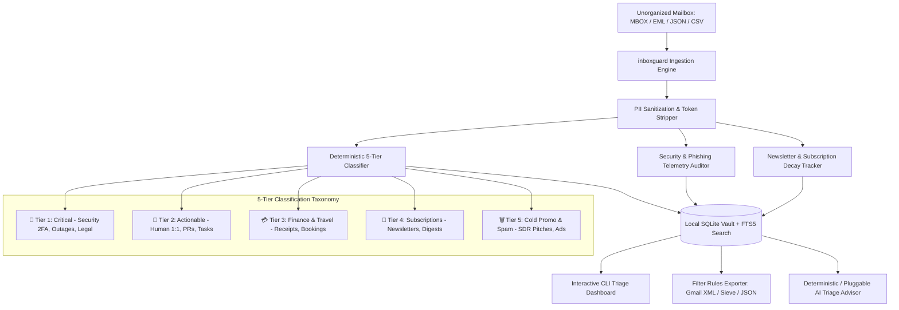

<div align="center">
  <div>&nbsp;</div>
  <h1>📬 inboxguard-core</h1>
  <p><strong>Local-First Email Triage, 5-Tier Classification, Newsletter Purge & Phishing Defense Engine</strong></p>

  [](#)
  [](#)
  [](https://github.com/astral-sh/ruff)
  [](#)
  [](LICENSE)
  [](#)
</div>

---

## 🌟 Overview & Why inboxguard-core?

Modern email inboxes are flooded with low-signal newsletters, unsolicited sales pitches, and deceptive phishing attempts, burying critical 2FA notifications, financial receipts, and human deliverables. Cloud-based email cleaning services often require granting intrusive OAuth read/write access to your private correspondence.

`inboxguard-core` is a **100% local-first, privacy-preserving email triage engine**. It ingests standard mailbox exports (MBOX, EML, JSON, CSV), executes deterministic 5-tier classification, detects RFC-2369 / RFC-8058 newsletter decay, audits headers for SPF/DKIM/DMARC spoofing, and exports production-ready **Gmail XML filters (`filters.xml`)** and **Sieve scripts** without ever sending a byte of private email data to the cloud.

---

## 🏗️ Architecture Flow



---

## 🗂️ 5-Tier Email Taxonomy

| Tier | Name | Target Content | Default Policy |
| :--- | :--- | :--- | :--- |
| **`TIER_1_CRITICAL`** | 🚨 Critical Security & Outages | 2FA/OTP codes, unauthorized access alerts, root login alerts, P0/P1 server outages, legal summons. | Priority Inbox, Star, Instant Alert |
| **`TIER_2_ACTIONABLE`** | 💬 Human & Work Correspondence | 1:1 peer conversations, pull request reviews, project deliverables, calendar invites requiring RSVP. | Main Inbox, Highlight |
| **`TIER_3_FINANCIAL_TRAVEL`** | 💳 Financial & Travel Logistics | Invoices, purchase receipts, flight confirmations, hotel bookings, shipping/tracking updates, tax forms. | Auto-Label `Finance/Receipts`, Archive |
| **`TIER_4_SUBSCRIPTIONS`** | 📰 Subscriptions & Newsletters | Weekly tech roundups, Substack/Medium digests, product announcements, RFC-2369 / RFC-8058 lists. | Auto-Label `Newsletters`, Skip Inbox |
| **`TIER_5_COLD_PROMO_SPAM`** | 🗑️ Cold Outreach & Marketing | SDR sales cadences, aggressive discount promos, unsolicited marketing blasts, bulk ads. | Mark as Read, Discard / Trash |

---

## ⚡ 30-Second Beginner Quickstart

### Step 1: Install inboxguard-core
```bash
git clone https://github.com/Muybi3n/AI_Projects.git
cd AI_Projects && git checkout inboxguard-core
pip install -e .
```

### Step 2: Initialize and Ingest Your Mailbox
```bash
# Initialize local database catalog
inboxguard init

# Ingest an MBOX, EML, JSON, or CSV mailbox export
inboxguard ingest path/to/mailbox.mbox
```

### Step 3: Run Instant Triage & Audit
```bash
# View 5-tier classification dashboard
inboxguard triage

# Identify deadweight newsletters to unsubscribe
inboxguard newsletters --threshold 0.4

# Audit for spoofed senders and phishing links
inboxguard security

# Export ready-to-import Gmail filters
inboxguard rules --format gmail --output filters.xml --generate-defaults
```

---

## 💻 Comprehensive CLI Command Reference

### 1. Ingestion (`inboxguard ingest`)
Supports RFC 4155 MBOX files (e.g. from Google Takeout), standalone `.eml` files, structured JSON, and CSV exports:
```bash
inboxguard ingest ~/Downloads/takeout.mbox
inboxguard ingest ~/Downloads/suspicious_email.eml
inboxguard ingest ~/Downloads/emails.json
```

### 2. Triage Dashboard (`inboxguard triage`)
Displays high-level distributions across all 5 tiers with ASCII progress bars, immediate Tier 1 alerts, and active security warnings:
```bash
inboxguard triage
inboxguard triage --json
```

### 3. Subscription & Newsletter Cleaner (`inboxguard newsletters`)
Calculates a **decay score** ($0.0$ to $1.0$) based on unread ratios and delivery volume to highlight subscriptions you no longer read:
```bash
inboxguard newsletters --threshold 0.3
```
*Output includes direct RFC-2369 one-click URLs and RFC-8058 mailto addresses for fast cleanup.*

### 4. Phishing & Security Telemetry (`inboxguard security`)
Audits SPF/DKIM/DMARC authentication headers, detects display name impersonation (e.g. "Google Support <admin@scam.xyz>"), flags punycode domains, and scans for raw IP links:
```bash
inboxguard security
```

### 5. Filter Rules Generation & Export (`inboxguard rules`)
Auto-generates optimized rules and exports directly to standard formats:
```bash
# Gmail XML Filter (Import directly in Gmail Web Settings -> Filters)
inboxguard rules --format gmail --output gmail_filters.xml --generate-defaults

# Sieve Script (For Fastmail, Dovecot, ProtonMail, and custom IMAP servers)
inboxguard rules --format sieve --output rules.sieve --generate-defaults

# JSON Schema (For programmatic rule integrations)
inboxguard rules --format json
```

### 6. SQLite FTS5 Full-Text Search (`inboxguard search`)
Blazing-fast local search across email subjects, bodies, and sender metadata:
```bash
inboxguard search "AWS root login"
inboxguard search "Flight confirmation" --limit 10
```

### 7. AI Triage Advisor (`inboxguard ask`)
Consult the offline deterministic reasoning advisor or connect your own local LLM:
```bash
inboxguard ask "What are my critical alerts today?"
inboxguard ask "Which newsletters should I purge?"
inboxguard ask "Draft a professional reply to the latest actionable message"
```

---

## 🤖 Connecting Your Own Local AI / LLM (Ollama, vLLM, OpenAI)

`inboxguard-core` operates 100% offline with zero external dependencies by default. You can seamlessly plug in a local or cloud LLM in **3 lines of Python**:

```python
from inboxguard import StorageEngine, InboxCompanion
import requests

def ollama_advisor(query: str, context: dict) -> str:
    prompt = f"Context: {context}\n\nUser Question: {query}\nProvide triage advice:"
    resp = requests.post("http://localhost:11434/api/generate", json={"model": "llama3.2", "prompt": prompt, "stream": False})
    return resp.json()["response"]

storage = StorageEngine()
companion = InboxCompanion(storage=storage, custom_llm_callable=ollama_advisor)
response = companion.consult("Summarize my urgent actions")
print(response.summary)
```

---

## 🔒 Security & Privacy Guarantees

> **⚠️ NOTE:** This project is for Proof of Concept (POC) and personal productivity use. 

- **Zero Cloud Leakage:** All parsing, indexing, and heuristic scoring happen locally in your SQLite database.
- **Zero Stored Credentials:** `inboxguard-core` does not store OAuth tokens, passwords, or IMAP credentials.
- **PII Scrubbing Seam:** Before passing email contexts to pluggable LLMs, all credit card numbers, SSNs, and JWT tokens are automatically scrubbed and redacted.

---

## ⚖️ Limited Liability & Legal Disclaimers

1. **Informational & POC Use Only:** `inboxguard-core` is provided strictly for exploratory data analysis, developer experimentation, and proof-of-concept mailbox organization. It does not constitute professional cybersecurity, legal, or IT compliance advice.
2. **No Warranty & "AS IS" Provision:** The software is provided "AS IS" without warranty of any kind, express or implied. The authors and contributors shall not be liable for any damages, accidental deletion, lost emails, or calculation errors arising from its use.
3. **User Responsibility:** Users are solely responsible for reviewing and verifying generated filter rules before applying them to production mailboxes.

---

## 🏷️ Trademarks & Licensing

All product names, logos, and brands (such as Gmail, Google Workspace, Apple Mail, Sieve, AWS, GitHub) are property of their respective owners. Use of these names is for identification and interoperability purposes only and does not imply endorsement.

Distributed under the **MIT License**. See [`LICENSE`](LICENSE) for details.
