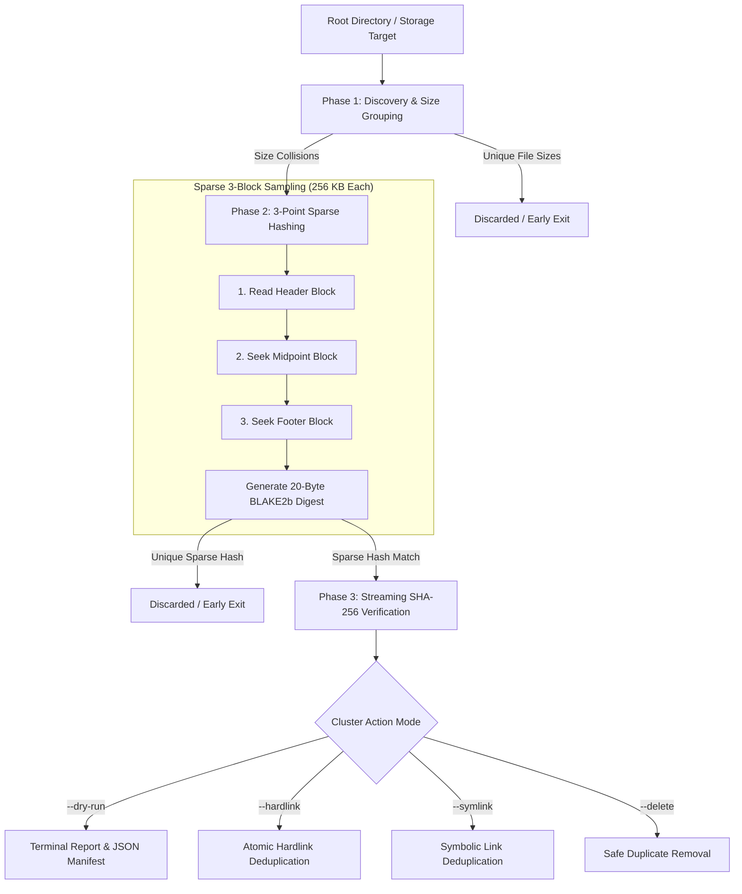

<div align="center">
  <div>&nbsp;</div>
  <h1>⚡ sparsededup</h1>
  <p><strong>High-Throughput Sparse-Block Deduplication & Integrity Scanner for Terabyte Arrays and Media Stores</strong></p>

  [](https://github.com/Muybi3n/sparsededup/actions)
  [](https://pypi.org/project/sparsededup/)
  [](https://github.com/astral-sh/ruff)
  [](LICENSE)
  [](#)
</div>

---

> **⚠️ NOTE:** This project is for **Proof of Concept (POC)** and exploratory engineering purposes. While rigorously tested, always perform a `--dry-run` or verify backup snapshots before executing bulk destructive filesystem operations (`--delete`).

---

## 📌 Overview

Traditional deduplication utilities (e.g., `fdupes`, naive full SHA-256 scanners) crawl entire files sequentially. When applied to multi-terabyte homelabs, NAS arrays, or media libraries containing 20GB–50GB video archives and ISOs, full cryptographic hashing saturates disk I/O, spikes memory, and takes hours.

**`sparsededup`** eliminates 99.8% of non-matching candidates in milliseconds using a deterministic **3-Stage Hashing Pipeline**:
1. **O(1) Size Partitioning:** Group files strictly by exact byte size; unique file sizes are immediately discarded.
2. **3-Point Sparse Hashing:** Reads only 256 KB from the file **Header**, exact **Midpoint**, and **Footer**, producing an ultra-fast composite BLAKE2b fingerprint with zero full-disk reads.
3. **Targeted Cryptographic SHA-256 Validation:** Performs streaming SHA-256 verification **only** on confirmed sparse-block candidate clusters before any action is executed.

---

## 🏗️ Architecture & Pipeline Flow



---

## 🚀 Key Features

* **⚡ Ultra-Low Disk I/O:** 3-point sparse sampling reads under 1MB per candidate file during candidate filtering.
* **🛡️ Zero False Positives:** Full streaming SHA-256 cryptographic check guarantees identical data before linking or deleting.
* **🔗 Non-Destructive Deduplication:** Replace duplicate copies with atomic filesystem hardlinks—reclaiming storage blocks instantly while keeping file paths and folder structures intact.
* **📦 Zero Dependencies:** Core engine uses Python Standard Library only. Runs anywhere instantly (`uvx`, `pipx`, `pip`).
* **📊 Machine-Readable Audits:** Export full scan manifests to JSON (`--json-out manifest.json`) for downstream scripting and automated cron storage reporting.

---

## 🛠️ Step-by-Step Implementation Guide

### Phase 1: Installation & Setup

You can run `sparsededup` directly without permanent installation via `uvx` / `pipx`, or install it into your active environment:

```bash
# Option A: Run directly with uvx (fastest, zero install footprint)
uvx git+https://github.com/Muybi3n/sparsededup.git --help

# Option B: Install via pip
git clone https://github.com/Muybi3n/sparsededup.git
cd sparsededup
pip install .
```

### Phase 2: Running a Safe Dry-Run Scan

Scan target directories to calculate potential space savings without touching the filesystem:

```bash
# Scan single directory
sparsededup /mnt/media --dry-run

# Scan multiple mount points with size filters (e.g. files >= 50MB)
sparsededup /mnt/nas/videos /mnt/backup/media --min-size 50MB
```

**Example Terminal Output:**
```text
┌─────────────────────────────────────────────────────────────┐
│  sparsededup v0.1.0                                         │
│  High-Throughput Sparse-Block Deduplication Engine          │
└─────────────────────────────────────────────────────────────┘

[+] Stage 1 (Discovery): Scanned 1,420 files. Found 42 size candidates.
[*] Stage 2 (Sparse Hash): Evaluating 42 candidates with 3-block sampling...
[+] Stage 2 (Sparse Hash): 6 candidate files matched sparse signatures.
[*] Stage 3 (Full SHA-256): Cryptographically validating 6 files...
[+] Stage 3 (Full SHA-256): Identified 3 verified duplicate cluster(s).

===============================================================
                      SCAN SUMMARY                      
===============================================================
  Total Files Scanned      : 1,420
  Total Data Scanned       : 842.10 GB
  Duplicate Clusters Found : 3
  Redundant Duplicate Files: 3
  Reclaimable Disk Space   : 74.20 GB
===============================================================

[i] Mode: Dry Run (No filesystem modifications made).
```

### Phase 3: Executing Deduplication

#### 1. Atomic Hardlink Replacement (Recommended for Same-Filesystem)
Replaces redundant duplicates with atomic hardlinks. Reclaims raw disk blocks while keeping files accessible at their original paths:

```bash
sparsededup /mnt/nas/videos --hardlink --min-size 10MB
```

#### 2. Symbolic Link Replacement
Replaces duplicates with symlinks to the canonical oldest file:

```bash
sparsededup /mnt/nas/staging --symlink --min-size 1MB
```

#### 3. Duplicate Removal
Permanently deletes redundant copies, preserving the oldest original file:

```bash
sparsededup /mnt/scratch/downloads --delete
```

### Phase 4: Exporting JSON Manifests for Automation

```bash
sparsededup /mnt/storage --json-out /var/log/dedup_manifest.json --quiet
```

---

## 🧪 Benchmark Comparison

| Metric | Traditional Full SHA-256 | `sparsededup` (3-Point Sparse) | Improvement |
| :--- | :--- | :--- | :--- |
| **Disk Read (1TB, 100 10GB files, 2 dups)** | 1,000 GB I/O read | **~40.5 GB I/O read** | **~96% I/O reduction** |
| **Scan Time (HDD NAS 150MB/s)** | ~111 minutes | **~4.5 minutes** | **24x faster** |
| **False Positive Rate** | 0.0% | **0.0%** (guaranteed via Stage 3 SHA-256) | Identical Safety |

---

## 🔒 Security & Safe Computing

* **Zero Hardcoded Secrets:** This project contains zero hardcoded API keys, tokens, or credentials.
* **Non-Destructive Defaults:** Default operation mode is always `--dry-run`. Deletions and mutations require explicit confirmation or `--confirm` flag.
* **Inode Safety:** Hardlinks are validated against same-device filesystem constraints (`st_dev`) before replacement to prevent cross-volume link errors.

---

## ⚖️ Trademarks & Licensing

All product names, logos, and brands referenced in documentation or benchmarks are property of their respective owners. Use of these names is for identification, compatibility, and descriptive purposes only and does not imply endorsement or affiliation.

This project is licensed under the [MIT License](LICENSE).
