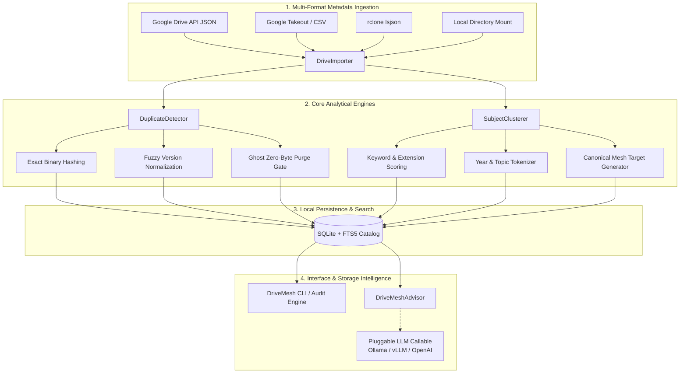

<div align="center">
  <div>&nbsp;</div>
  <h1>📁 DriveMesh Core</h1>
  <p><strong>Local-First Google Drive & Cloud Storage Subject Clustering, Mesh Taxonomy & Fuzzy Version Deduplication Engine</strong></p>

  [](https://github.com/Muybi3n/AI_Projects/actions)
  [](#)
  [](https://github.com/astral-sh/ruff)
  [](#)
  [](LICENSE)
  [](#)
</div>

---

## 🌟 Overview

Cloud storage drives frequently evolve into cluttered, unindexed dumping grounds filled with redundant file copies (`Copy of...`, `(1)`), obsolete revision chains (`Proposal_v2_FINAL.docx`), unorganized root files, and forgotten tax, medical, or legal documents.

**`drivemesh-core`** is a high-throughput, local-first engine that analyzes cloud drive metadata (via Google Drive API JSON exports, Google Takeout, `rclone lsjson`, or local directory mounts) to:
1. **Cluster Disorganized Files into Clean Domain Meshes**: Categorizes documents into hierarchical taxonomy trees (`Financial & Tax`, `Legal & Contracts`, `Health & Medical`, `Engineering & Dev`, `Work & Operations`, etc.).
2. **Detect Cryptographic & Fuzzy Version Duplicates**: Matches identical binary checksums (BLAKE2b/SHA-256/MD5) while identifying version sprawl chains, date-stamped backups, and zero-byte ghost files.
3. **Calculate Reclaimable Storage & Generate Move Plans**: Produces atomic, non-destructive migration manifests and deletion lists to reclaim wasted gigabytes.
4. **Offline Heuristic AI Storage Advisor**: Delivers instant natural language recommendations and supports a pluggable 3-line LLM adapter (Ollama, vLLM, OpenAI-compatible endpoints) without requiring external dependencies.

---

## 🏗️ System Architecture



---

## ✨ Key Capabilities

- **🔒 100% Local-First & Zero Credentials**: Runs entirely offline on exported metadata or local mirrors. No OAuth credentials, API keys, or proprietary data are ever transmitted off-machine.
- **⚡ 4-Tier Duplicate Detection Pipeline**:
  - `EXACT_CHECKSUM`: Identifies identical files across disparate folder trees via streaming BLAKE2b/SHA-256/MD5 checksums.
  - `NAME_AND_SIZE`: Detects matching filenames and byte footprints when hashes are omitted in export manifests.
  - `FUZZY_VERSION`: Normalizes iterative revision patterns (e.g. `_v1`, `_final`, `(1)`, `copy of`, timestamps) to isolate obsolete historical drafts.
  - `ORPHAN_ZERO_BYTE`: Surfaces corrupted or empty uploads cluttering directory hierarchies.
- **🗂️ Deterministic Taxonomy Mesh**: Automatically maps files into structured domain directories (`/Financial_Tax/2024/`, `/Health_Medical/Labs/`, `/Engineering_Dev/Backups/`).
- **📊 Storage Health Score (0-100)**: Evaluates root clutter ratio, duplicate waste percentage, and unorganized file density.
- **🔍 SQLite FTS5 Search**: Sub-millisecond full-text queries over filenames, paths, and categorized clusters.
- **🤖 Pluggable AI Storage Advisor**: Offline heuristic reasoner by default, with a pluggable adapter for local LLMs (Ollama/vLLM) to assist in storage planning.

---

## ⚡ 30-Second Quickstart

### Installation

```bash
# Clone the showcase branch
git clone -b drivemesh-core https://github.com/Muybi3n/AI_Projects.git
cd AI_Projects

# Install in editable mode
pip install -e .
```

### Try Demo Mode (Out of the Box)

Run a complete audit on synthetic messy Google Drive data:

```bash
drivemesh demo
```

Output:
```text
============================================================
📊 GOOGLE DRIVE / CLOUD STORAGE HEALTH & MESH AUDIT
============================================================
🏆 Health Score:             78 / 100
📁 Total Files Indexed:       14
💾 Total Storage Used:        1.02 GB
🧹 Reclaimable Space:         866.50 KB
⚠️  Duplicate Groups:          4
🏚️  Orphaned Root Clutter:     3 files
👻 Zero-Byte Ghost Files:     1 files
👥 Shared Files:              0 files

📂 Category Distribution:
   • Financial & Tax          : 5 files
   • Engineering & Code       : 3 files
   • Legal & Contracts        : 2 files
   • Health & Medical         : 2 files
   • Media & Assets           : 1 files
   • General / Uncategorized  : 1 files

💡 Actionable Recommendations:
   1. Purge duplicate files to reclaim 0.8 MB of cloud storage.
   2. Move 3 orphaned files from root 'My Drive' into categorized taxonomy meshes.
   3. Delete 1 empty/corrupted zero-byte files.
============================================================
```

---

## 🛠️ Command-Line Interface Reference

| Command | Description | Example |
| :--- | :--- | :--- |
| `drivemesh scan <source>` | Ingests metadata from JSON, CSV, or local directory. | `drivemesh scan export.json` |
| `drivemesh cluster` | Discovers subject clusters and prints proposed directory mesh. | `drivemesh cluster` |
| `drivemesh duplicates` | Audits exact, fuzzy, and ghost zero-byte duplicates. | `drivemesh duplicates --type all` |
| `drivemesh audit` | Displays comprehensive storage health score and metrics. | `drivemesh audit --json` |
| `drivemesh plan` | Generates atomic file relocation and deletion execution plan. | `drivemesh plan --out plan.json` |
| `drivemesh search <query>` | Performs fast SQLite FTS5 search across all metadata. | `drivemesh search "tax return"` |
| `drivemesh ask "<prompt>"` | Consults the deterministic AI storage advisor. | `drivemesh ask "How to clean duplicates?"` |
| `drivemesh demo` | Populates synthetic dataset and runs full demonstration. | `drivemesh demo` |

---

## 🐍 Python API Usage

```python
from drivemesh import DriveImporter, DuplicateDetector, SubjectClusterer, DriveMeshAdvisor, DriveStorage

# 1. Ingest metadata
files = DriveImporter.load_from_json("drive_export.json")

# 2. Identify duplicate groups
detector = DuplicateDetector(files)
duplicates = detector.run_all()
for dup in duplicates:
    print(f"[{dup.duplicate_type.value}] {dup.explanation} -> Wasted: {dup.wasted_bytes} bytes")

# 3. Discover taxonomy meshes
clusterer = SubjectClusterer(files)
clusters = clusterer.cluster_all()
for cluster in clusters:
    print(f"Cluster: {cluster.category.value} -> Path: {cluster.suggested_target_path}")

# 4. Generate restructuring plan
plan = clusterer.build_mesh_plan()
print(f"Proposed relocations: {len(plan.proposed_moves)}")

# 5. Query the AI Storage Advisor (Deterministic Heuristics or Pluggable LLM)
advisor = DriveMeshAdvisor(files=files, clusters=clusters)
response = advisor.ask("How should I structure my folder taxonomy?")
print(response)
```

---

## 🛡️ Security, Privacy & Compliance

- **Zero-Cloud Telemetry**: All analysis, hashing, and database queries occur strictly on the local host.
- **Credential Isolation**: Operates on exported metadata manifests; no active Google account tokens or passwords are required or stored.
- **Enterprise-Defensible Standards**: Developed strictly for legitimate file management, homelab maintenance, and personal storage organization.

---

## 📄 License & Disclaimer

Distributed under the [MIT License](LICENSE).

*Disclaimer: `drivemesh-core` is an analytical and organizational tool. Always verify file relocation and deletion plans before applying irreversible file operations on live production drives.*
