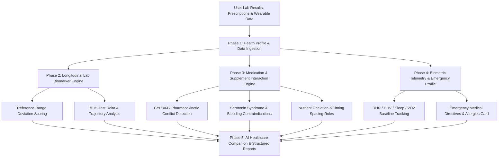

<div align="center">
  <div>&nbsp;</div>
  <h1>🩺 medcadence-core</h1>
  <p><strong>Personal Health Telemetry, Lab Biomarker Ledger, Medication Interaction Safety Engine & AI Healthcare Companion</strong></p>

  [](https://github.com/Muybi3n/AI_Projects/actions)
  [](#)
  [](https://github.com/astral-sh/ruff)
  [](LICENSE)
  [](#)
</div>

---

> **🚨 CRITICAL MEDICAL DISCLAIMER:** This project is strictly for **informational, tracking, educational, and personal wellness modeling purposes**. It is **NOT medical advice, diagnosis, or clinical treatment**. Always consult a licensed medical physician before starting, stopping, or altering any medication, supplement, or medical protocol. **IN A MEDICAL EMERGENCY, CALL 911 OR YOUR LOCAL EMERGENCY SERVICES IMMEDIATELY.**

---

## 📌 Overview

Patients frequently experience fragmented healthcare management:
* **Siloed Lab Portals:** Bloodwork results sit locked across disparate lab portals (Quest, Labcorp, hospital portals) with no unified longitudinal trend tracking.
* **Dangerous Medication/Supplement Interactions:** Polypharmacy and OTC dietary supplements (e.g., St. John's Wort with SSRIs, grapefruit with statins, calcium with iron) often slip past brief clinical visits without automated contraindication checks.
* **Wearable Telemetry Disconnect:** Daily biometric telemetry (RHR, HRV, sleep architecture, VO2 Max) is rarely synthesized with periodic clinical blood tests.

**`medcadence-core`** is an offline, privacy-first personal health record and clinical companion. It unifies lab biomarker trajectories, automates medication safety audits, logs biometric wearable telemetry, and provides an AI Healthcare Companion to translate clinical jargon into actionable questions for your next doctor's visit.

---

## 🏗️ Architecture & Health Data Flow



---

## 🚀 Key Features

* **🔒 100% Local-First & Zero Cloud Leakage:** All blood biomarker histories, prescription lists, and medical directives remain encrypted and stored locally in `~/.medcadence/`. Zero cloud transmission.
* **🩸 Longitudinal Lab Biomarker Tracker:** Tracks blood panels (Lipid Panel, Fasting Glucose, HbA1c, hs-CRP, Thyroid TSH, eGFR, Vitamin D) with standard clinical reference bounds and delta trajectories.
* **🚨 Rule-Based Medication Safety Auditor:** Scans active medications and dietary supplements against clinical contraindication matrices (CYP enzyme inhibition, Serotonin toxicity, chelation binding).
* **⌚ Wearable Biometric Ingestion:** Logs Resting Heart Rate (RHR), Heart Rate Variability (HRV rMSSD), Sleep Architecture, and VO2 Max.
* **🤖 Pluggable AI Healthcare Companion:** Translates complex biomarker deviations into plain English and prepares structured questions for your primary care physician using local LLMs (Ollama / vLLM) or custom cloud endpoints.

---

## 🌟 30-Second Beginner Quickstart

Get up and running in 3 copy-paste steps:

```bash
# 1. Install medcadence
pip install -e .

# 2. Initialize your profile and add a lab result
medcadence init --label "Alex" --sex male --birth-year 1990
medcadence lab add --name "LDL Cholesterol" --value 135 --high 100 --unit "mg/dL"
medcadence lab trends

# 3. Audit prescriptions/supplements and ask the AI companion
medcadence med add --name "Atorvastatin" --dosage "20mg"
medcadence med add --name "Grapefruit Juice" --supplement
medcadence med audit
medcadence ask "What questions should I ask my doctor?"
```

---

## 🛠️ Step-by-Step Implementation Guide

### Phase 1: Installation & Setup

```bash
# Clone the repository
git clone https://github.com/Muybi3n/AI_Projects.git
cd AI_Projects

# Install in editable mode
pip install -e .
```

### Phase 2: Initializing Your Health Profile

```bash
medcadence init --label "Alex" --sex male --birth-year 1988
```

### Phase 3: Logging Bloodwork & Viewing Longitudinal Trends

```bash
# Log baseline lipid panel
medcadence lab add --name "LDL Cholesterol" --category lipid_panel --value 138.0 --low 0 --high 100 --unit "mg/dL"
medcadence lab add --name "HbA1c" --category metabolic_glycemic --value 5.3 --low 4.0 --high 5.6 --unit "%"
medcadence lab add --name "hs-CRP" --category inflammatory_cardio --value 0.6 --low 0.0 --high 1.0 --unit "mg/L"

# View trends
medcadence lab trends
```

**Example Lab Trends Output:**
```text
===========================================================================
                   LONGITUDINAL BIOMARKER TRENDS                 
===========================================================================
  • HbA1c                    :    5.30 %        [optimal       ] (Baseline)
  • hs-CRP                   :    0.60 mg/L     [optimal       ] (Baseline)
  • LDL Cholesterol          :  138.00 mg/dL    [borderline_high] (Baseline)
===========================================================================
```

### Phase 4: Auditing Medication & Supplement Interactions

```bash
# Add prescription and OTC supplement
medcadence med add --name "Atorvastatin" --dosage "20mg" --frequency "daily"
medcadence med add --name "Grapefruit Juice" --supplement

# Run safety audit
medcadence med audit
```

**Example Safety Audit Output:**
```text
===========================================================================
               MEDICATION & SUPPLEMENT SAFETY AUDIT               
===========================================================================

🚨 [SEVERE] Atorvastatin + Grapefruit Juice
   Mechanism : CYP3A4 inhibition increases statin systemic bioavailability and risk of rhabdomyolysis.
   Guidance  : Avoid concurrent grapefruit consumption with CYP3A4-metabolized statins.
===========================================================================
```

### Phase 5: Querying the AI Healthcare Companion

```bash
medcadence ask "What questions should I ask my doctor about my elevated LDL?"
```

**Example AI Companion Output:**
```text
━━━━━━━━━━━━━━━━━━━━━━━━━━━━━━━━━━━━━━━━━━━━━━━━━━━━━━━━━━━━━━━━━━━━━━
🤖 AI HEALTHCARE COMPANION: 'What questions should I ask my doctor about my elevated LDL?'
━━━━━━━━━━━━━━━━━━━━━━━━━━━━━━━━━━━━━━━━━━━━━━━━━━━━━━━━━━━━━━━━━━━━━━

🎯 CLINICAL SYNTHESIS:
Health record contains 3 tracked lab biomarker(s). Currently, 1 biomarker(s) 
(LDL Cholesterol: 138.0 mg/dL) fall outside standard reference ranges.

⚠️ OUT-OF-RANGE BIOMARKERS:
  • LDL Cholesterol: 138.0 mg/dL (Status: borderline_high)

📋 QUESTIONS FOR YOUR DOCTOR:
  • What follow-up testing schedule is appropriate for out-of-range biomarkers?
  • Would an ApoB or Coronary Artery Calcium (CAC) scan provide more granular cardiovascular risk stratification?
  • Are dietary fiber and saturated fat adjustments sufficient before altering statin dosing?

🌿 WELLNESS CONSIDERATIONS:
  • Increase soluble dietary fiber (oats, psyllium husk, legumes) to assist LDL clearance.
━━━━━━━━━━━━━━━━━━━━━━━━━━━━━━━━━━━━━━━━━━━━━━━━━━━━━━━━━━━━━━━━━━━━━━
```

---

## 🔒 Privacy & HIPAA-Conscious Architecture

* **Zero Cloud Retention:** Operates entirely on the local machine.
* **PII Sanitization:** Strips full names, addresses, and government identifiers before formatting context for AI reasoning models.

---

## ⚖️ Disclaimer of Liability & Clinical Notice

### 1. Not Medical, Diagnostic, or Clinical Advice
This software and all associated documentation, algorithms, and AI outputs are provided strictly for **informational, educational, and Proof of Concept (POC) wellness tracking purposes**. Nothing contained in this codebase or generated by `medcadence-core` constitutes medical advice, clinical diagnosis, prognosis, treatment recommendations, or prescription guidance.

### 2. No Doctor-Patient Relationship
Use of this software does not establish a physician-patient, clinician-patient, or healthcare provider relationship between you and the authors or contributors of this project.

### 3. Limitation of Liability & "AS IS" Warranty
THE SOFTWARE IS PROVIDED "AS IS", WITHOUT WARRANTY OF ANY KIND, EXPRESS OR IMPLIED, INCLUDING BUT NOT LIMITED TO THE WARRANTIES OF MERCHANTABILITY, FITNESS FOR A PARTICULAR PURPOSE, AND NONINFRINGEMENT.

IN NO EVENT SHALL THE AUTHORS, MAINTAINERS, CONTRIBUTORS, OR COPYRIGHT HOLDERS BE LIABLE FOR ANY CLAIM, DAMAGES, MEDICAL COMPLICATIONS, DRUG INTERACTIONS, ADVERSE HEALTH EVENTS, MISSED DIAGNOSES, DELAYED MEDICAL CARE, OR OTHER LIABILITY—WHETHER IN AN ACTION OF CONTRACT, TORT (INCLUDING NEGLIGENCE), STRICT LIABILITY, OR OTHERWISE—ARISING FROM, OUT OF, OR IN CONNECTION WITH THE SOFTWARE.

### 4. User Assumption of Risk
You expressly acknowledge that health data and medical decisions carry inherent biological risks. You are solely responsible for discussing all laboratory biomarker results, medication regimens, and supplement plans with a licensed physician or healthcare professional.

---

## 📜 Trademarks & Licensing

Quest Diagnostics, Labcorp, Apple Health, Garmin, Oura, Whoop, and all other brand names referenced in documentation are property of their respective trademark holders. Use of these names is for identification and descriptive purposes only.

This project is licensed under the [MIT License](LICENSE).
