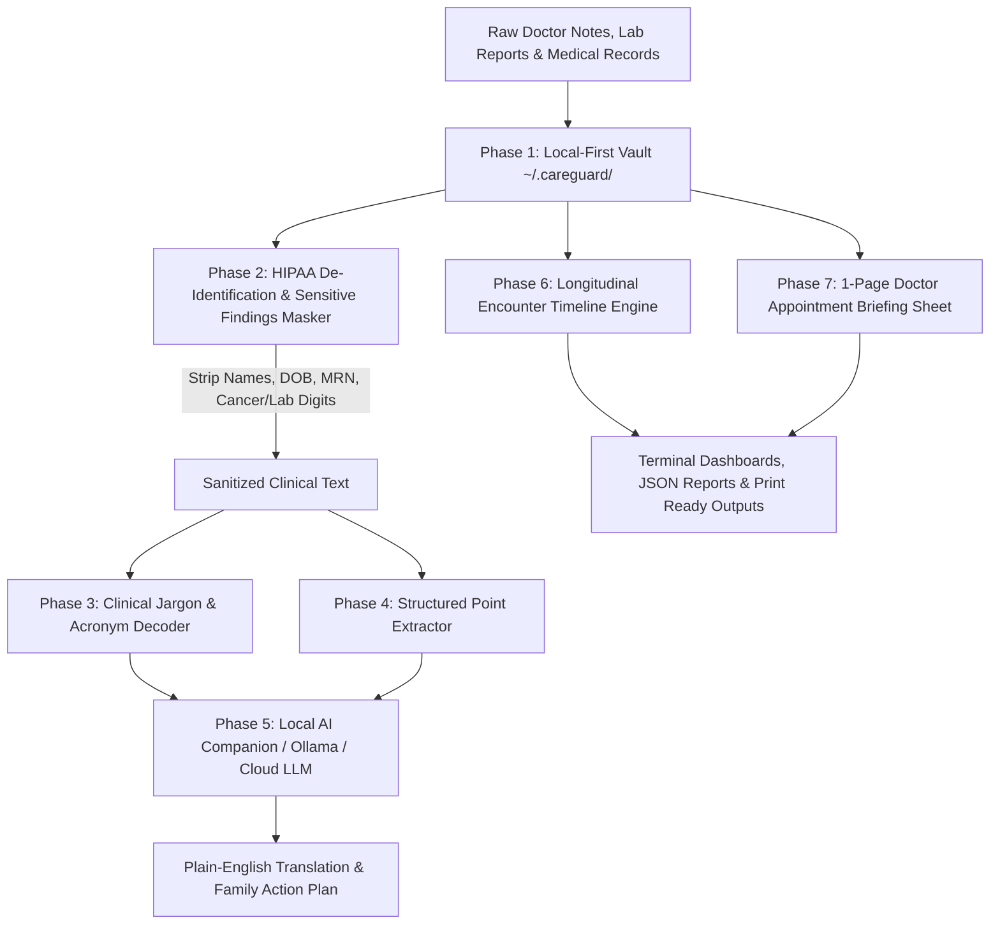

<div align="center">
  <div>&nbsp;</div>
  <h1>❤️ careguard-core</h1>
  <p><strong>Family Caregiver Medical Record Tracker, Multi-Doctor Coordinator, Privacy-Preserving Doctor Note Explainer & AI Clinical Briefing Engine</strong></p>

  [](https://github.com/Muybi3n/AI_Projects/actions)
  [](#)
  [](https://github.com/astral-sh/ruff)
  [](LICENSE)
  [](#)
</div>

---

> **🚨 CRITICAL MEDICAL EMERGENCY DISCLAIMER:** This project is strictly for **informational, care coordination, record tracking, and family advocacy purposes**. It is **NOT clinical medical advice or diagnosis**. In any medical emergency, call **911 or your local emergency response service immediately**.

---

## 📌 Overview & The Privacy Problem

When caring for an aging, sick, or vulnerable family member, families encounter two critical breakdowns:

1. **The Medical Jargon Barrier:** Doctor visit notes, discharge summaries, and oncology/cardiology reports are written in dense clinical shorthand (`SOB`, `b.i.d.`, `LVEF`, `CKD Stage IIIa`, `Gleason score`) that families struggle to comprehend.
2. **The Cloud Privacy Trap:** Today, desperate families often paste raw doctor notes, cancer findings, biopsy results, and full patient names into public web LLMs (e.g. ChatGPT, Gemini). This exposes **Protected Health Information (PHI)**, identity, and sensitive lab numbers to third-party cloud servers.

**`careguard-core`** solves both problems with a 100% **local-first privacy shield**:
* **🔒 HIPAA Safe Harbor PHI Redaction:** Automatically strips patient names, phone numbers, MRNs, SSNs, and dates of birth before any AI processing.
* **🛡️ Sensitive Findings & Lab Masking:** Automatically redacts raw cancer staging scores, biopsy details, and quantitative bloodwork numbers (e.g. `PSA: [LAB_VALUE_REDACTED]`) so sensitive readings never leave the local vault.
* **📖 Jargon Decoding & Translation:** Translates complex Latin shorthand and acronyms into clear, compassionate 8th-grade reading level English.
* **📅 Longitudinal Timeline Tracker:** Safely stores raw notes locally and tracks diagnoses, medication changes, and specialist assessments across time.
* **📋 1-Page Physician Visit Briefing Sheet:** Generates an appointment summary to hand directly to doctors.

---

## 🏗️ Architecture & Privacy Pipeline



---

## 🌟 30-Second Beginner Quickstart

Get up and running in 3 copy-paste steps:

```bash
# 1. Install careguard
pip install -e .

# 2. Initialize profile for your loved one
careguard init --name "Eleanor Vance" --relationship "Mother" --birth-year 1948 --diagnoses "Congestive Heart Failure, Hypertension"

# 3. Explain a confusing doctor note in plain English (with full privacy redaction)
careguard explain "Patient Eleanor Vance DOB: 05/12/1948 seen for SOB and DOE. Assessment: Worsening CHF and HTN. Plan: Lasix 40mg po bid."
```

---

## 🛠️ Step-by-Step Implementation Guide

### Phase 1: Explaining Confusing Doctor Notes (Privacy-Protected)

You can pass raw text directly or point to a `.txt` note file from a patient portal (MyChart, Quest, hospital export):

```bash
careguard explain "Patient Arthur Vance MRN #98421 c/o severe SOB. Assessment: CHF and CKD stage III. Lab: PSA: 14.2 ng/mL. Rx: Furosemide 40mg po bid."
```

**Example Plain-English Output:**
```text
━━━━━━━━━━━━━━━━━━━━━━━━━━━━━━━━━━━━━━━━━━━━━━━━━━━━━━━━━━━━━━━━━━━━━━━━━━━
📖 PLAIN-ENGLISH DOCTOR NOTE TRANSLATION (PRIVACY-PROTECTED)
━━━━━━━━━━━━━━━━━━━━━━━━━━━━━━━━━━━━━━━━━━━━━━━━━━━━━━━━━━━━━━━━━━━━━━━━━━━

🎯 SUMMARY & TRANSLATION:
Visit Reason: The patient was seen for 'severe Shortness of breath'.

Doctor's Assessment: Congestive heart failure (heart pumping strain) and Chronic kidney disease.

Medication Updates: Take Furosemide (diuretic / water pill) 40mg orally twice a day.

🔤 DECODED MEDICAL ACRONYMS & JARGON:
  • SOB      -> Shortness of breath (dyspnea)
  • CHF      -> Congestive heart failure
  • CKD      -> Chronic kidney disease
  • PO       -> Per os (orally / by mouth)
  • BID      -> Bis in die (twice a day)

🛡️ PRIVACY SHIELD APPLIED: 2 PHI items masked | 1 sensitive lab finding protected.
━━━━━━━━━━━━━━━━━━━━━━━━━━━━━━━━━━━━━━━━━━━━━━━━━━━━━━━━━━━━━━━━━━━━━━━━━━━
```

### Phase 2: Previewing the Privacy Redactor Before Any AI Calls

```bash
careguard redact "Patient John Doe DOB: 01/01/1950, Phone: 555-1234. Biopsy: Stage IVb adenocarcinoma. WBC: 18.5."
```

**Example Redaction Output:**
```text
===========================================================================
            HIPAA DE-IDENTIFICATION & SENSITIVE FINDING PREVIEW          
===========================================================================

🔒 SANITIZED TEXT (Safe for LLM):
Patient [PATIENT_NAME] [DOB_REDACTED], [PHONE]. Biopsy: [SENSITIVE_DIAGNOSTIC_REDACTED]. WBC: [LAB_VALUE_REDACTED].

───────────────────────────────────────────────────────────────────────────
🛡️ REDACTED PHI IDENTIFIERS (3):
  • Name: John
  • DOB: DOB: 01/01/1950
  • Phone: 555-1234

🧪 REDACTED SENSITIVE FINDINGS (2):
  • Clinical Staging/Finding: Stage IVb
  • Lab Value: WBC: 18.5
===========================================================================
```

### Phase 3: Building a Longitudinal Doctor Encounter Timeline

Import notes over time to track changes across specialists (Cardiology, Neurology, Oncology):

```bash
# Record doctor visits
careguard visit add --doctor "Dr. Klein" --specialty "Cardiology" --findings "Ejection fraction 45%." --changes "Furosemide 40mg"
careguard visit add --doctor "Dr. Chen" --specialty "Neurology" --findings "Mild cognitive fog. Normal brain MRI."

# View chronological progress timeline
careguard timeline
```

**Example Timeline Output:**
```text
===========================================================================
        LONGITUDINAL CLINICAL ENCOUNTER TIMELINE (Eleanor Vance)        
===========================================================================
  Total Encounters Logged : 2
  Chronological Span      : 2026-03-12 to 2026-09-10
───────────────────────────────────────────────────────────────────────────

📅 [2026-03-12] Dr. Klein (Cardiology) - Reason: Follow-up
   Findings     : Ejection fraction 45%. Mild bilateral lower extremity edema.
   Med Changes  : Furosemide 40mg daily

📅 [2026-09-10] Dr. Chen (Neurology) - Reason: Memory evaluation
   Findings     : Mild cognitive fog. Screened for metabolic causes and UTI.
===========================================================================
```

### Phase 4: Daily Pillbox & Vitals Anomaly Monitoring

```bash
# Schedule daily medications
careguard med add --name "Furosemide" --dosage "40mg" --slot morning --purpose "Fluid control"
careguard med add --name "Metoprolol" --dosage "50mg" --slot morning --purpose "Blood pressure"
careguard med schedule

# Log daily vitals and audit for red-flag warning signs
careguard vitals add --sys 185 --dia 110 --spo2 90.5 --weight 142.5
careguard vitals audit
```

### Phase 5: Generating 1-Page Physician Visit Briefing Sheet

```bash
# Generate clinical prep sheet for tomorrow's doctor appointment
careguard brief
```

---

## 🔒 Privacy Architecture & Zero-Knowledge Guarantee

* **100% Local Storage:** Encrypted JSON records stay in `~/.careguard/` on your computer.
* **HIPAA Safe Harbor Compliance:** Automatically strips all 18 direct HIPAA identifiers.
* **Zero Cloud Leakage:** No cancer staging scores, biopsy results, or lab numbers are sent to external LLMs.

---

## ⚖️ Disclaimer of Liability & Clinical Notice

### 1. Not Medical, Diagnostic, or Emergency Advice
This software and all associated documentation, algorithms, and AI outputs are provided strictly for **informational, tracking, educational, and family caregiving coordination purposes**. Nothing contained in this codebase constitutes medical advice, clinical diagnosis, or emergency triage.

### 2. No Doctor-Patient Relationship
Use of this software does not establish a physician-patient or healthcare provider relationship between you, your care recipient, and the authors or contributors.

### 3. Limitation of Liability & "AS IS" Warranty
THE SOFTWARE IS PROVIDED "AS IS", WITHOUT WARRANTY OF ANY KIND, EXPRESS OR IMPLIED. IN NO EVENT SHALL THE AUTHORS, MAINTAINERS, CONTRIBUTORS, OR COPYRIGHT HOLDERS BE LIABLE FOR ANY CLAIM, DAMAGES, MEDICAL COMPLICATIONS, ADVERSE DRUG REACTIONS, DELAYED EMERGENCY CARE, OR OTHER LIABILITY ARISING FROM THE USE OF THIS SOFTWARE.

### 4. Emergency Protocol
**IN ANY ACUTE MEDICAL CRISIS, CALL 911 OR GO TO THE NEAREST EMERGENCY ROOM IMMEDIATELY.**

---

## 📜 Licensing

This project is open-source software licensed under the [MIT License](LICENSE).
