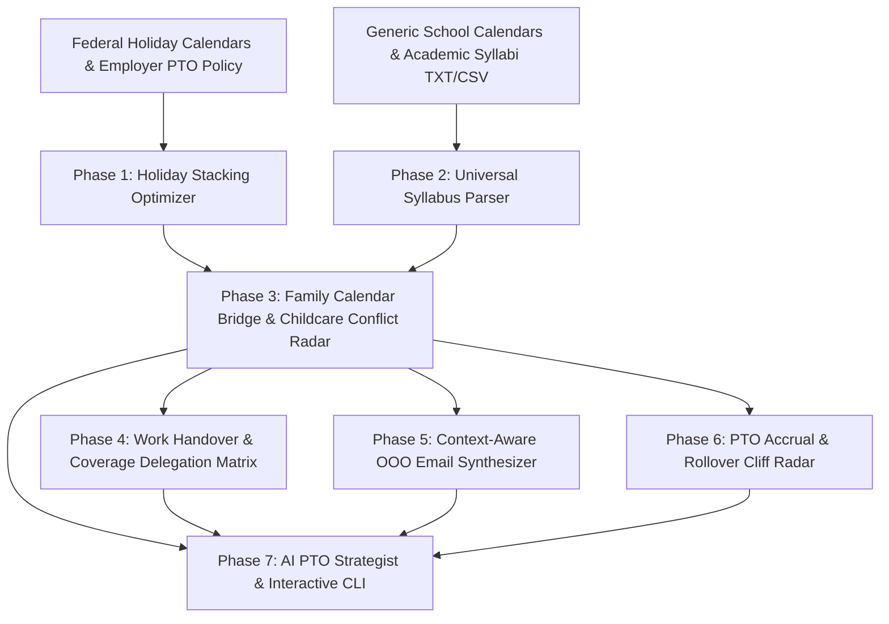

<div align="center">
  <div>&nbsp;</div>
  <h1>🌴 ptomax-core</h1>
  <p><strong>PTO Holiday Stacking Optimizer, Multi-School Syllabus & Calendar Ingestion, Work Handover Matrix & OOO Email Synthesizer</strong></p>

  [](https://github.com/Muybi3n/AI_Projects/actions)
  [](#)
  [](https://github.com/astral-sh/ruff)
  [](LICENSE)
  [](#)
</div>

---

## 📌 Overview

Balancing demanding career commitments, engineering on-call rotations, family school schedules, and meaningful personal rest is a friction-filled challenge:

* **Holiday & School Stacking Inefficiency:** Taking random isolated days off instead of synchronizing work PTO with **Federal holidays** and **K-12 school district calendars or university syllabi** to maximize consecutive family time off.
* **Childcare Conflict Blindspots:** Forgetting upcoming school-specific student holidays, teacher planning days, or early releases where kids have no school, but parents have normal working days.
* **Multi-Child Syllabus Fragmentation:** Managing different syllabi across multiple children or university courses with separate break schedules and exam periods.
* **Handover & Coverage Anxiety:** Stepping away without structured project handovers, causing emergency on-call pings and stalled PRs.
* **The Year-End Forfeiture Cliff:** Losing hard-earned accrued PTO days on December 31st due to unmonitored rollover caps.

**`ptomax-core`** is an open-source, local-first engine and CLI that solves the PTO knapsack optimization problem, parses unstructured school calendars and academic syllabi, maps project delegation matrices, generates tailored OOO emails, and predicts leave balances.

---

## 🏗️ Architecture & Family Sync Workflow



---

## 🌟 30-Second Quickstart

```bash
# 1. Install ptomax
pip install -e .

# 2. View PTO balance and calculate optimal 2026 holiday bridges
ptomax balance
ptomax optimize --days 15 --year 2026

# 3. Import school calendar / syllabi and check for childcare conflicts
ptomax school import --file district_calendar.txt --source "Metro School District" --students "Student A, Student B"
ptomax school conflicts
ptomax school family-breaks

# 4. Generate an OOO email and consult the AI Strategist
ptomax ooo --start 2026-07-03 --end 2026-07-12 --style external
ptomax ask "How can I get 9 days off in May aligned with school breaks?"
```

---

## 🛠️ Step-by-Step Feature Walkthrough

### 1. Ingesting Generic School Calendars & Syllabi

Import any school district calendar, college syllabus, or plain text date listing:

```bash
# Import from raw text or file
ptomax school import --text "2026-10-09: Student Holiday / Teacher Planning Day
2026-11-02 to 2026-11-03: Teacher Workday
2026-11-25 to 2026-11-27: Thanksgiving Break
2027-03-29 to 2027-04-02: Spring Break" \
                     --source "Metro School District" \
                     --students "Student A, Student B"
```

### 2. Childcare Conflict Radar

Automatically alerts parents when kids have no school, but parents have a normal work day (no federal holiday):

```bash
ptomax school conflicts
```

**Example Output:**
```text
╔══════════════════════════════════════════════════════════════════╗
║               🌴 PTOMAX LEAVE & HOLIDAY OPTIMIZER                ║
╚══════════════════════════════════════════════════════════════════╝
╭──────────────────── 🚨 Childcare Conflict Radar (Workdays with No School) ────────────────────╮
│ Date        Day       School Event                       Source School          Action Needed │
│ 2026-10-09  Friday    Student Holiday / Planning Day     Metro School District  Plan PTO      │
│ 2026-11-02  Monday    Teacher Workday                    Metro School District  Plan PTO      │
│ 2026-11-03  Tuesday   Teacher Workday                    Metro School District  Plan PTO      │
╰───────────────────────────────────────────────────────────────────────────────────────────────╯
💡 Tip: Use 'ptomax ooo' or submit a PTO request for these dates before calendar slots fill up.
```

### 3. Family Vacation Windows

Finds contiguous multi-day spans where kids are off school that can be easily bridged with parent PTO:

```bash
ptomax school family-breaks
```

### 4. Holiday Stacking & PTO Maximization

Transforms 15 PTO days into **36–50+ consecutive days of vacation** (2.25x to 4.0x leverage):

```bash
ptomax optimize --days 15 --year 2026
```

### 5. Work Handover Delegation Matrix

```bash
# Add coverage delegate
ptomax coverage add --project "Mac Mini SOC & Threat Triage" \
                    --primary-name "Sarah Jenkins" \
                    --primary-contact "sarah@company.internal" \
                    --threshold "P0 Outages only"

# View 1-page team handover summary
ptomax coverage list
```

### 6. Out-of-Office (OOO) Email Generator

Synthesizes tailored OOO templates across styles (`external`, `internal`, `urgent`, `witty`):

```bash
ptomax ooo --start 2026-05-23 --end 2026-05-31 --style external
```

---

## 🔒 Privacy & Local Storage

* **100% Local File Storage:** All PTO balances, school syllabi, children's schedules, and coverage rosters remain strictly in `~/.ptomax/profile.json`.
* **Zero Cloud Tracking:** No school portal logins, employer credentials, or personal calendar data are ever shared externally.

---

## 📜 License

This project is licensed under the [MIT License](LICENSE).
