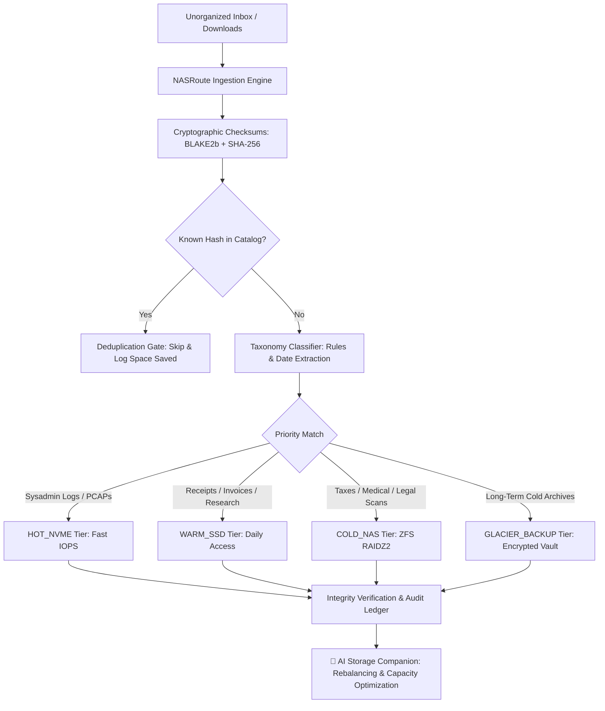

<div align="center">
  <div>&nbsp;</div>
  <h1>🗄️ nasroute-core</h1>
  <p><strong>Homelab & Document Storage Routing Engine with Deterministic Taxonomy, Cryptographic Integrity & Multi-Tier Management</strong></p>

  [](#)
  [](LICENSE)
  [](#)
  [](https://github.com/astral-sh/ruff)
  [](#)
  [](#)
</div>

---

## 🌟 Overview

**`nasroute-core`** is a high-performance, privacy-first storage router and taxonomy classification engine built for homelabs, home offices, and self-hosted environments. It automatically classifies, deduplicates, and routes incoming unorganized files (tax records, medical documentation, legal deeds, sysadmin telemetry, receipts, research papers, and document scans) into hierarchical, tiered storage mounts (HOT NVMe, WARM SSD, COLD NAS ZFS pools, and Glacier backup vaults).

### Why `nasroute-core`?
- 🔒 **100% Local-First & Zero-Cloud:** No cloud dependencies, no tracking, and zero credentials stored. Everything executes locally on your workstation or home server.
- ⚡ **Dual Cryptographic Checksums:** Computes streaming BLAKE2b (high-throughput) and SHA-256 (audit-grade) hashes to guarantee byte-for-byte integrity and prevent bit-rot.
- 🧩 **Zero-Copy & Multi-Action Routing:** Supports `MOVE`, `COPY`, `SYMLINK`, and `HARDLINK` across filesystems and storage mounts.
- 🚫 **Deduplication Engine:** Automatically flags and suppresses redundant file ingestion, saving gigabytes of storage across multi-terabyte arrays.
- 🤖 **Pluggable AI Storage Companion:** Ships with an offline deterministic heuristic advisor and a pluggable LLM adapter for Ollama, vLLM, or OpenAI-compatible backends.

---

## 🌟 30-Second Beginner Quickstart

Get up and running in 3 copy-paste terminal steps:

```bash
# 1. Install nasroute-core locally
pip install -e .

# 2. Scan an unorganized folder to preview classification and deduplication
nasroute scan ~/Downloads

# 3. Route incoming documents to your storage tiers with verified integrity
nasroute route ~/Downloads --action copy
```

---

## 🏗️ Architecture & Storage Flow



---

## 💾 Storage Tier Hierarchy

| Tier | Speed Class | Recommended Data Types | Retention & Target Storage |
| :--- | :--- | :--- | :--- |
| **`HOT_NVME`** | `NVMe Gen4 (7,000+ MB/s)` | High-IOPS configs, Docker manifests, live syslog/audit streams | Active working sets, local NVMe pools |
| **`WARM_SSD`** | `SATA SSD (550 MB/s)` | Current fiscal year receipts, active medical records, research papers | Fast indexing, zero spin-up latency |
| **`COLD_NAS`** | `ZFS RAIDZ2 / HDD (250 MB/s)` | Historical tax filings (7+ years), immutable PDFs, legal deeds | Massive multi-TB redundant storage |
| **`GLACIER_BACKUP`** | `Cold Vault / Tape` | Offsite disaster recovery bundles, annual sealed archives | Long-term encrypted preservation |

---

## 🛠️ Complete CLI Command Reference

### 1. Initialize Workspace
```bash
nasroute init
# Output:
# [*] Initialized NASRoute repository at: ~/.nasroute
# [*] Registered Storage Tiers: 4
# [*] Active Taxonomy Rules:   7
```

### 2. Scan Directory (With Checksums & Taxonomy Preview)
```bash
nasroute scan /path/to/inbox
```

### 3. Route Documents
```bash
# Dry run simulation
nasroute route /path/to/inbox --dry-run

# Real execution via copy with cryptographic verification
nasroute route /path/to/inbox --action copy

# Zero-copy hardlink routing on supported filesystems
nasroute route /path/to/inbox --action hardlink
```

### 4. Manage Taxonomy Rules
```bash
# List all active classification rules
nasroute rules list

# Add a custom rule for Docker & Kubernetes configs
nasroute rules add --id rule_k8s \
  --name "Kubernetes Manifests" \
  --category HOMELAB_SYSADMIN \
  --tier HOT_NVME \
  --subpath "Homelab/K8s/{year}/{filename}" \
  --keywords "k8s,helm,deployment" \
  --priority 160

# Remove an outdated rule
nasroute rules remove --id rule_old
```

### 5. Storage Mount Configuration
```bash
# List registered storage tiers
nasroute tiers list

# Register a custom ZFS pool mount
nasroute tiers add --name COLD_NAS \
  --mount /mnt/storage_pool/archive \
  --speed "ZFS_RAIDZ2" \
  --capacity-gb 32000
```

### 6. Storage & Deduplication Audit
```bash
nasroute audit
# Displays total files indexed, duplicate count, and exact space saved
```

### 7. Consult the AI Storage Companion
```bash
nasroute ask "How should I structure my 2024 tax filings and homelab logs?"
```

---

## 🤖 Connecting Your Own Local AI / LLM (Ollama, vLLM, OpenAI)

`nasroute-core` works 100% offline out-of-the-box using deterministic heuristic reasoning. You can also connect any local or cloud LLM in 3 lines:

```python
import json
import urllib.request
from nasroute import NASRouteCompanion, NASRouteStore

def ollama_llm(prompt: str, context: dict) -> str:
    """Connect to local Ollama instance running llama3/mistral."""
    req_body = json.dumps({
        "model": "llama3",
        "prompt": f"Context: {json.dumps(context)}\n\nQuery: {prompt}",
        "stream": False,
    }).encode("utf-8")
    req = urllib.request.Request("http://localhost:11434/api/generate", data=req_body, headers={"Content-Type": "application/json"})
    with urllib.request.urlopen(req) as resp:
        return json.loads(resp.read().decode())["response"]

store = NASRouteStore()
companion = NASRouteCompanion(custom_llm_callable=ollama_llm)
response = companion.consult("Suggest a retention policy for tax documents", store)
print(response.summary)
```

---

## 🔒 Security & Proof of Concept (POC) Disclaimer

> **⚠️ NOTE:** This project is for **Proof of Concept (POC)** and personal homelab utility purposes only. It is not intended for mission-critical enterprise document management without adequate independent backup policies. Always maintain redundant 3-2-1 backups of all critical documents.

---

## ⚖️ Limited Liability & Warranty Disclaimer

1. **Informational & Educational Use Only:** The software is provided for organizational, archival, and data modeling purposes.
2. **No Warranty & Limitation of Liability:** THE SOFTWARE IS PROVIDED "AS IS", WITHOUT WARRANTY OF ANY KIND, EXPRESS OR IMPLIED. IN NO EVENT SHALL THE AUTHORS BE LIABLE FOR ANY DATA LOSS, HARDWARE DAMAGE, SYSTEM CORRUPTION, OR BUSINESS INTERRUPTION ARISING FROM THE USE OF THIS SOFTWARE.
3. **User Assumption of Risk:** Users are solely responsible for testing file operations (especially `MOVE` actions) with `--dry-run` and maintaining verified external backups before executing mass file transformations.

---

## 📜 Trademarks & Open Source Licensing

*All product names, logos, brands, and registered trademarks mentioned (such as ZFS, Docker, Kubernetes, Proxmox, TrueNAS, WireGuard, Ollama) are property of their respective owners. Their use is for identification and interoperability purposes only and does not imply endorsement.*

Licensed under the [MIT License](LICENSE).
