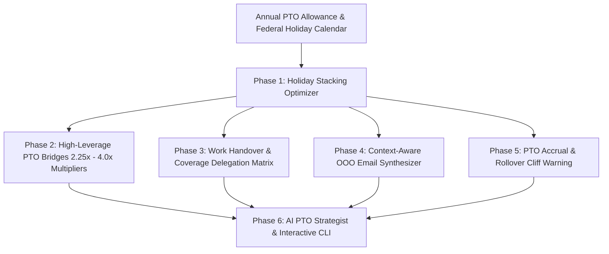

<div align="center">
  <div>&nbsp;</div>
  <h1>🌴 ptomax-core</h1>
  <p><strong>PTO Holiday Stacking Optimizer, Work Handover Coverage Matrix, OOO Email Synthesizer & Leave Accrual Engine</strong></p>

  [](https://github.com/Muybi3n/AI_Projects/actions)
  [](#)
  [](https://github.com/astral-sh/ruff)
  [](LICENSE)
  [](#)
</div>

---

## 📌 Overview

Balancing career performance, engineering on-call rotations, and meaningful personal rest is a continuous challenge for professionals and developers:

* **Sub-Optimal PTO Burn:** Taking random isolated Wednesdays or Fridays instead of strategically stacking PTO around federal/statutory holidays to double or triple consecutive time off.
* **Handover & Coverage Anxiety:** Leaving on vacation without explicit project delegates, resulting in emergency Slack pings, broken on-call rotations, and stalled PRs.
* **Out-of-Office (OOO) Writer's Block:** Scrambling to draft tone-appropriate OOO emails for clients, engineering teammates, and stakeholders 10 minutes before signing off.
* **The Year-End Use-It-Or-Lose-It Cliff:** Forfeiting hard-earned accrued PTO days on December 31st because of unmonitored rollover caps.

**`ptomax-core`** is an open-source, local-first optimization engine and CLI that solves the PTO knapsack problem, manages project delegation matrices, generates tailored OOO templates, and forecasts leave balances.

---

## 🏗️ Architecture & Workflow



---

## 🌟 30-Second Quickstart

```bash
# 1. Install ptomax
pip install -e .

# 2. View your current PTO balance and calculate optimal 2026 holiday bridges
ptomax balance
ptomax optimize --days 15 --year 2026

# 3. Add project coverage delegates and generate an OOO email
ptomax coverage add --project "Wazuh SOC & Threat Triage" --primary-name "Sarah Jenkins" --primary-contact "sarah@company.internal"
ptomax ooo --start 2026-07-03 --end 2026-07-12 --style external
ptomax ask "What is the best way to get 9 days off in May?"
```

---

## 🛠️ Step-by-Step CLI Features

### 1. Holiday Stacking & PTO Maximization

Transform 15 days of PTO into **45+ consecutive days of vacation** by anchoring days around standard public holidays:

```bash
ptomax optimize --days 15 --year 2026
```

**Example Output:**
```text
╔══════════════════════════════════════════════════════════════════╗
║               🌴 PTOMAX LEAVE & HOLIDAY OPTIMIZER                ║
╚══════════════════════════════════════════════════════════════════╝
Target Year: 2026 | PTO Days Budget: 15 Days

╭───────────────────── 🌴 Optimized Holiday Stacking Schedule (2026) ─────────────────────╮
│ Break Name                     Date Range              PTO Burn  Days Off  Leverage     │
│ Memorial Day 9-Day Mega-Break  2026-05-23 to 2026-05-31  4 Days    9 Days   2.25x       │
│ Independence Day 9-Day Mega    2026-06-27 to 2026-07-05  4 Days    9 Days   2.25x       │
│ Labor Day 9-Day Mega-Break     2026-09-05 to 2026-09-13  4 Days    9 Days   2.25x       │
│ Thanksgiving 9-Day Fall Break  2026-11-21 to 2026-11-29  3 Days    9 Days   3.00x       │
╰────────────────────────────────────────────────────────────────────────────────────────╯

SUMMARY: By burning 15 PTO days, you unlock 36 total consecutive days off (2.4x leverage!).
```

### 2. Work Coverage & Handover Matrix

Ensure zero broken builds and seamless on-call coverage while you are away:

```bash
# Add coverage delegate
ptomax coverage add --project "Production API Gateway" \
                    --primary-name "Marcus Vance" \
                    --primary-contact "marcus.vance@company.internal" \
                    --threshold "P0 Outages only"

# View 1-page team handover summary
ptomax coverage list
```

### 3. Out-of-Office (OOO) Email Generator

Synthesizes tailored OOO templates across styles: `external` (clients/vendors), `internal` (engineering team), `urgent` (strict offline boundary), or `witty`:

```bash
ptomax ooo --start 2026-05-23 --end 2026-05-31 --style external
```

### 4. Accrual & Rollover Cliff Radar

Alerts you before you forfeit vacation days due to company rollover caps:

```bash
ptomax accrual
```

---

## 🔒 Local-First Privacy Directives

* **100% Local File Storage:** All PTO balances, employer policies, and colleague coverage rosters remain strictly in `~/.ptomax/profile.json`.
* **Zero Cloud Leakage:** No employer credentials, calendar tokens, or company confidential information are ever shared externally.

---

## 📜 License

This project is licensed under the [MIT License](LICENSE).
