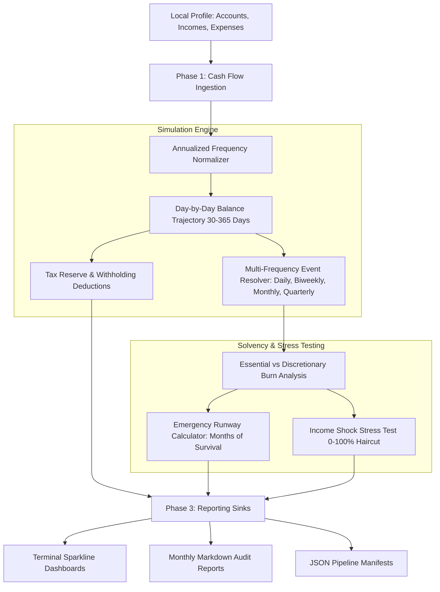

<div align="center">
  <div>&nbsp;</div>
  <h1>💰 flowbalance-core</h1>
  <p><strong>Deterministic Local-First Cash Flow Forecasting, Multi-Bucket Allocation & Solvency Runway Engine</strong></p>

  [](https://github.com/Muybi3n/AI_Projects/actions)
  [](#)
  [](https://github.com/astral-sh/ruff)
  [](LICENSE)
  [](#)
</div>

---

> **⚠️ NOTE:** This project is for **Proof of Concept (POC)** and personal financial modeling purposes only. It is not licensed financial or tax advice. Always verify calculations before making capital allocation decisions.

---

## 📌 Overview

Most personal finance apps suffer from one of three flaws: they sell user transaction data to advertisers, require expensive cloud subscriptions, or only look backward at historical spending without forecasting future liquidity.

**`flowbalance-core`** is a deterministic, 100% offline personal finance engine that simulates your forward daily cash flow over 30 to 365 days. It models recurring income streams, tax withholdings, essential vs. discretionary burn rates, and evaluates your emergency solvency runway under sudden income shock scenarios.

---

## 🏗️ Architecture & Simulation Flow



---

## 🚀 Key Features

* **🔒 100% Local-First & Zero Cloud Retention:** All account balances and financial records stay on your local machine (`~/.flowbalance/`). Zero bank credentials, zero cloud tracking.
* **📈 Forward-Looking Deterministic Trajectory:** Simulates daily cash balances up to 365 days into the future, accurately scheduling irregular inflows (biweekly paychecks, quarterly tax payments).
* **🛡️ Solvency & Runway Stress-Testing:** Calculates emergency buffer survival months (AAA to C ratings) under 0% to 100% income loss scenarios.
* **📊 Terminal Sparklines & Markdown Audits:** Renders ASCII trajectory sparklines directly in your terminal and generates detailed monthly Markdown reports.
* **📦 Zero Dependencies:** Core simulation and storage engine built on pure Python 3.10+ standard library.

---

## 🛠️ Step-by-Step Implementation Guide

### Phase 1: Installation & Setup

```bash
# Clone the repository
git clone https://github.com/Muybi3n/AI_Projects.git
cd AI_Projects

# Install in editable mode
pip install -e .
```

### Phase 2: Configuring Accounts & Inflows

```bash
# Add checking and emergency savings accounts
flowbalance account add --name "Primary Checking" --balance 7500
flowbalance account add --name "Emergency Vault" --balance 25000

# Add recurring biweekly salary with 22% tax withholding
flowbalance income add --name "Software Consulting" --amount 4500 --frequency biweekly --tax-pct 22

# Add recurring monthly expenses
flowbalance expense add --name "Mortgage / Rent" --amount 2400 --frequency monthly --category needs
flowbalance expense add --name "Groceries & Utilities" --amount 800 --frequency monthly --category needs
flowbalance expense add --name "Dining & Entertainment" --amount 500 --frequency monthly --category wants --non-essential
```

### Phase 3: Running Cash Flow Projections

```bash
# Run 180-day forward cash trajectory
flowbalance forecast --days 180
```

**Example Terminal Output:**
```text
┌─────────────────────────────────────────────────────────────┐
│  flowbalance v0.1.0                                         │
│  Deterministic Cash Flow & Wealth Velocity Engine           │
└─────────────────────────────────────────────────────────────┘

============================================================
                  CASH FLOW FORECAST                    
============================================================
  Starting Balance     : $32,500.00
  Projected Balance    : $55,840.00  (+$23,340.00)
  Monthly Burn Rate    : $3,700.00/mo
  Solvency Rating      : AAA (Fortress Runway >= 12 mos)
  Emergency Runway     : 10.2 Months
  Projection Sparkline : [ ▂▃▄▅▅▆▆▇████]
============================================================
```

### Phase 4: Stress-Testing Financial Resilience

Simulate what happens if income drops by 50% or 100%:

```bash
# Simulate 100% immediate income loss
flowbalance stress-test --haircut 100
```

**Example Stress-Test Output:**
```text
============================================================
       SOLVENCY STRESS TEST (100% Income Loss)       
============================================================
  Available Liquid Capital : $32,500.00
  Baseline Monthly Burn    : $3,700.00
  Essential Monthly Burn   : $3,200.00
  Full Runway Duration     : 8.8 Months
  Essential Runway         : 10.2 Months
  Solvency Rating          : AA (Solid Emergency Buffer 6-12 mos)
============================================================
```

### Phase 5: Exporting Reports for Audits

```bash
# Export monthly Markdown health audit
flowbalance forecast --days 90 --out ~/documents/financial_audit.md

# Export raw JSON timeline for scripts
flowbalance forecast --days 30 --json
```

---

## 🔒 Security & Privacy

* **Zero Cloud Connection:** No third-party APIs, bank scraping tokens, or credentials stored.
* **No Telemetry:** Works completely offline in air-gapped environments.

---

## ⚖️ Trademarks & Licensing

All product names, logos, and brands referenced in documentation are property of their respective owners. Use of these names is for identification and descriptive purposes only and does not imply endorsement.

This project is licensed under the [MIT License](LICENSE).
