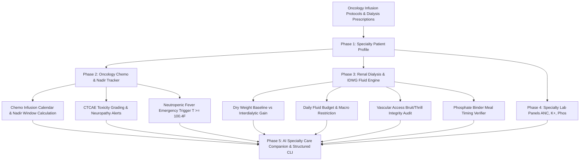

<div align="center">
  <div>&nbsp;</div>
  <h1>🎗️ oncorenal-core</h1>
  <p><strong>Oncology Chemotherapy Cycle Tracker, Renal Dialysis Fluid/Dry Weight Ledger & AI Specialty Care Companion</strong></p>

  [](https://github.com/Muybi3n/AI_Projects/actions)
  [](#)
  [](https://github.com/astral-sh/ruff)
  [](LICENSE)
  [](#)
</div>

---

> **🚨 CRITICAL MEDICAL EMERGENCY DISCLAIMER:** This project is strictly for **informational, protocol tracking, and family caregiving coordination purposes**. It is **NOT clinical medical advice, oncology diagnosis, or nephrology management**. **IN A MEDICAL EMERGENCY (E.G. CHEMOTHERAPY FEVER >= 100.4°F, CHEST PAIN, OR ACUTE SHORTNESS OF BREATH), CALL 911 OR YOUR ONCOLOGY/DIALYSIS TRIAGE LINE IMMEDIATELY.**

---

## 📌 Overview

Patients undergoing active cancer treatments (chemotherapy/immunotherapy) or renal replacement therapy (hemodialysis / peritoneal dialysis) face high-stakes clinical management challenges:

### 1. The Oncology Challenge (Chemo Cycles & Neutropenic Nadir):
* **Immune Nadir Windows:** Days 7–14 following chemotherapy infusions are when white blood cells (neutrophils) crash to their lowest levels, exposing patients to life-threatening sepsis.
* **Neutropenic Fever Emergencies:** A single oral temperature of $\ge 100.4^\circ\text{F}$ during the nadir window is an oncologic emergency requiring immediate IV antibiotics.
* **CTCAE Toxicity Tracking:** Tracking peripheral neuropathy, mucositis (mouth sores), and severe nausea before irreversible nerve damage occurs.

### 2. The Renal / Dialysis Challenge (Dry Weight & Fluid Overload):
* **Interdialytic Weight Gain (IDWG):** Balancing fluid accumulation between dialysis runs. Gaining $> 3-5\%$ of dry weight risks acute pulmonary edema, hypertensive emergency, and severe muscle cramping during ultrafiltration.
* **Renal Macro Guardrails:** Tracking daily fluid budgets (1000–1200 mL), potassium limits (hyperkalemia cardiac arrest risk), and timing phosphate binders with meals.
* **Vascular Access Health:** Daily monitoring of AV fistula/graft *thrill* and *bruit* to prevent clot formation.

**`oncorenal-core`** is an offline, privacy-first specialty care engine designed to automate chemo nadir calendars, calculate interdialytic fluid balances, audit oncology/renal red flags, and provide an AI Specialty Companion for clinical guidance.

---

## 🏗️ Architecture & Specialty Care Flow



---

## 🌟 30-Second Beginner Quickstart

Get up and running in 3 copy-paste steps:

```bash
# 1. Install oncorenal
pip install -e .

# 2. Initialize profile and add your chemotherapy regimen & dialysis dry weight
oncorenal init --name "George Vance" --cancer-dx "Colorectal Cancer" --renal-dx "ESRD on Hemodialysis" --dry-weight 70.0 --fluid-limit 1000
oncorenal chemo add --regimen "FOLFOX" --cycle 1 --total 6 --length 14 --nadir-start 5 --nadir-end 10

# 3. Check immune nadir status, calculate fluid overload, and ask the AI companion
oncorenal chemo nadir
oncorenal dialysis session --pre-wt 72.5 --post-wt 70.0 --uf 2.5
oncorenal dialysis idwg
oncorenal ask "What precautions should we take during the chemo nadir window?"
```

---

## 🛠️ Step-by-Step Implementation Guide

### Phase 1: Installation & Setup

```bash
# Clone the repository
git clone https://github.com/Muybi3n/AI_Projects.git
cd AI_Projects

# Switch to oncorenal-core branch and install
git checkout oncorenal-core
pip install -e .
```

### Phase 2: Managing Chemotherapy Cycles & Nadir Windows

```bash
# Add active chemotherapy protocol
oncorenal chemo add --regimen "AC-T (Doxorubicin/Cyclophosphamide)" --cycle 2 --total 4 --length 21 --nadir-start 7 --nadir-end 14

# Check active nadir immune crash status
oncorenal chemo nadir
```

**Example Nadir Output:**
```text
===========================================================================
                 CHEMOTHERAPY NADIR IMMUNE MONITOR               
===========================================================================
  Regimen          : AC-T (Cycle 2)
  Current Cycle Day: Day 8 of 21 [🚨 IN IMMUNE NADIR WINDOW]
  Nadir Window     : 2026-09-17 to 2026-09-24
  Next Infusion    : 2026-10-01
───────────────────────────────────────────────────────────────────────────
  CLINICAL ADVISORY:
  IMMUNE NADIR ALERT (Day 8 of 21): White blood cells and neutrophils are at expected 
  cycle low. Avoid sick contacts and crowded indoor environments. 
  ANY FEVER >= 100.4°F REQUIRES IMMEDIATE EMERGENCY ONCOLOGY EVALUATION.
===========================================================================
```

### Phase 3: Logging Chemo Toxicities & Fever Alerts

```bash
# Log daily side-effects
oncorenal chemo log-tox --temp 99.1 --nausea 1 --neuropathy 2 --notes "Mild tingling in fingertips."
```

### Phase 4: Dialysis Sessions & Interdialytic Weight Gain (IDWG)

```bash
# Log dialysis session
oncorenal dialysis session --pre-wt 72.8 --post-wt 70.0 --uf 2.8 --pre-sys 155 --pre-dia 92

# Calculate Interdialytic Weight Gain vs Dry Weight Target
oncorenal dialysis idwg
```

**Example IDWG Output:**
```text
===========================================================================
             INTERDIALYTIC WEIGHT GAIN (IDWG) AUDIT              
===========================================================================
  Target Dry Weight      :   70.0 kg (154.3 lbs)
  Latest Pre-Dialysis Wt :   72.8 kg (160.5 lbs)
  Fluid Gain Accumulation:   +2.8 kg (+6.2 lbs | 4.0%)
───────────────────────────────────────────────────────────────────────────
  Fluid Overload Status  : MODERATE_RISK (Elevated Fluid Retention)
  Guidance               : Moderate fluid gain (+6.2 lbs / 4.0%). Requires strict adherence to daily fluid restriction.
===========================================================================
```

### Phase 5: Tracking Daily Fluid Budgets & Phosphate Binders

```bash
# Log daily fluid intake and verify phosphate binder synchronization
oncorenal fluid log --ml 850.0 --potassium 1600 --phosphorus 800 --binders-taken
```

### Phase 6: Querying the AI Oncology & Renal Specialty Companion

```bash
oncorenal ask "How do I manage fluid limits when taking chemo antiemetics?"
```

**Example AI Companion Output:**
```text
━━━━━━━━━━━━━━━━━━━━━━━━━━━━━━━━━━━━━━━━━━━━━━━━━━━━━━━━━━━━━━━━━━━━━━━━━━━
🤖 AI ONCOLOGY & RENAL SPECIALTY COMPANION: 'How do I manage fluid limits...'
━━━━━━━━━━━━━━━━━━━━━━━━━━━━━━━━━━━━━━━━━━━━━━━━━━━━━━━━━━━━━━━━━━━━━━━━━━━

🎯 CLINICAL SUMMARY:
Integrated specialty care overview: Managing Colorectal Cancer and ESRD on Hemodialysis.

🎗️ ONCOLOGY PROTOCOLS & PRECAUTIONS:
  • Take antiemetic medications (Zofran/Dexamethasone) proactively before nausea escalates.
  • Check oral cavity daily for signs of mucositis / mouth ulcers.

💧 DIALYSIS & FLUID GUIDELINES:
  • Use ice chips or small spray bottles to manage thirst without exceeding daily fluid cap.
  • Take phosphate binders (Renvela / PhosLo) strictly with the first bite of every meal.

⚡ SPECIALTY CAREGIVER CHECKLIST:
  • Take oral temperature twice daily. Seek immediate emergency care for T >= 100.4°F.
  • Check AV fistula / graft daily for healthy 'thrill' (vibration) and 'bruit' (whooshing sound).
━━━━━━━━━━━━━━━━━━━━━━━━━━━━━━━━━━━━━━━━━━━━━━━━━━━━━━━━━━━━━━━━━━━━━━━━━━━
```

---

## 🔒 Local-First Privacy Protection

* **100% Local Storage:** All chemotherapy records, dialysis weights, and lab panels remain stored locally in `~/.oncorenal/`.
* **Zero Cloud Leakage:** No cancer staging scores, biopsy details, or private medical numbers are ever forwarded to external LLMs.

---

## ⚖️ Disclaimer of Liability & Clinical Notice

### 1. Not Oncology or Nephrology Medical Advice
This software and all associated documentation, algorithms, and AI outputs are provided strictly for **informational, tracking, educational, and specialty caregiving coordination purposes**. Nothing contained in `oncorenal-core` constitutes oncology treatment plans, chemotherapy dosage calculations, or dialysis prescription modifications.

### 2. Emergency Protocol
**IN ANY ACUTE MEDICAL CRISIS (E.G. FEVER $\ge 100.4^\circ\text{F}$ POST-CHEMO, CLOTTED AV FISTULA, OR ACUTE SHORTNESS OF BREATH), CALL 911 OR CONTACT YOUR 24/7 ONCOLOGY/DIALYSIS CLINIC IMMEDIATELY.**

---

## 📜 Licensing

This project is licensed under the [MIT License](LICENSE).
