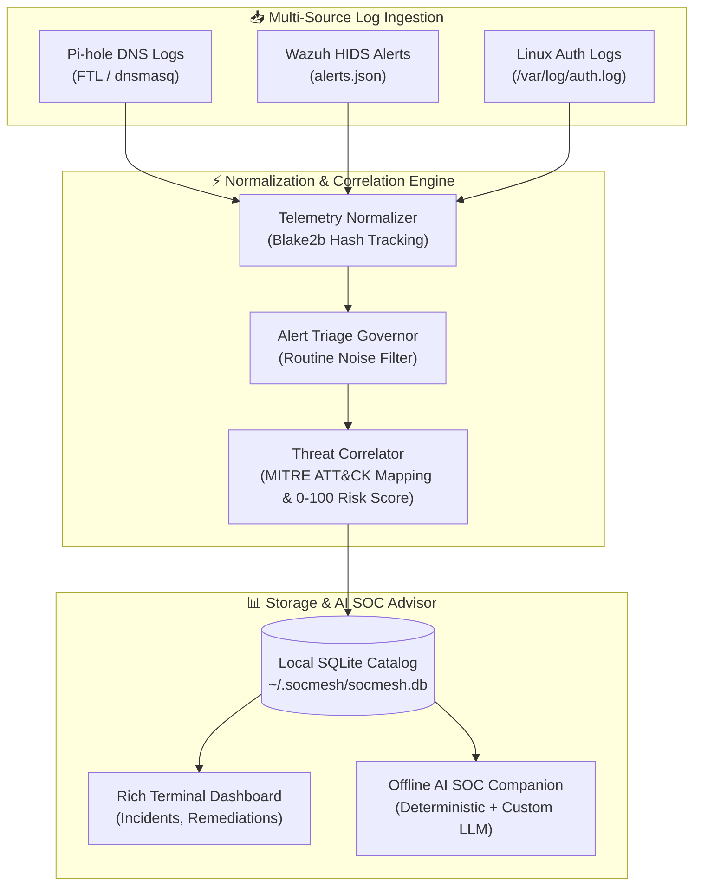

<div align="center">
  <div>&nbsp;</div>
  <h1>🛡️ socmesh-audit</h1>
  <h3>Homelab & Mini-SOC Telemetry Normalizer, Threat Correlation Engine & Alert Triage Governor</h3>
  <p><strong>A 100% local-first, privacy-preserving threat correlation and alert triage pipeline for Wazuh HIDS, Pi-hole DNS sinkholes, and Linux system logs.</strong></p>

  [](LICENSE)
  [](https://python.org)
  [](tests)
  [](https://github.com/astral-sh/ruff)
  [](https://attack.mitre.org)
  [](#)
</div>

---

## 📌 The Problem: Homelab Alert Fatigue & Disparate Silos

Operating a homelab or Mini-SOC (e.g. running Wazuh SIEM, Pi-hole DNS sinkholes, and Linux servers) creates two critical challenges:
1. **Siloed Telemetry:** An attacker attempting SSH brute forcing on a server while a compromised internal container beacons to a sinkholed C2 domain generates disconnected events across disparate log formats.
2. **Alert Fatigue & Noise Storms:** Routine internal health checks, NTP syncs, and apt cron jobs flood notification channels, obscuring genuine multi-stage adversary tactics.

**`socmesh-audit`** solves this with a unified, local-first correlation and noise-filtering engine that aggregates logs, maps tactics to the **MITRE ATT&CK framework**, scores threat blast radius (0–100), and provides automated remediation guidance.

---

## 🏗️ Architecture & Dataflow


```mermaid
flowchart TD
    subgraph INGESTION ["📥 Multi-Source Log Ingestion"]
        P["Pi-hole DNS Logs<br/>(FTL / dnsmasq)"]
        W["Wazuh HIDS Alerts<br/>(alerts.json)"]
        A["Linux Auth Logs<br/>(/var/log/auth.log)"]
    end

    subgraph CORE ["⚡ Normalization & Correlation Engine"]
        N["Telemetry Normalizer<br/>(Blake2b Hash Tracking)"]
        T["Alert Triage Governor<br/>(Routine Noise Filter)"]
        C["Threat Correlator<br/>(MITRE ATT&CK Mapping & 0-100 Risk Score)"]
    end

    subgraph OUTPUT ["📊 Storage & AI SOC Advisor"]
        DB[("Local SQLite Catalog<br/>~/.socmesh/socmesh.db")]
        CLI["Rich Terminal Dashboard<br/>(Incidents, Remediations)"]
        AI["Offline AI SOC Companion<br/>(Deterministic + Custom LLM)"]
    end

    P --> N
    W --> N
    A --> N
    N --> T
    T --> C
    C --> DB
    DB --> CLI
    DB --> AI
```

---

## 🔑 Key Capabilities

- **🔒 100% Local-First & Zero-Cloud:** Runs completely offline without cloud dependencies, API key leaks, or external telemetry egress.
- **🗂️ Unified Telemetry Normalization:** Ingests raw syslog, Pi-hole dnsmasq/gravity logs, Linux `auth.log`, and structured Wazuh `alerts.json`.
- **🎯 MITRE ATT&CK Alignment:** Correlates and tags events directly to standard adversary tactics:
  - `TA0001`: Initial Access
  - `TA0006`: Credential Access (SSH brute forcing)
  - `TA0011`: Command and Control (C2 beaconing)
  - `TA0005`: Defense Evasion
  - `TA0004`: Privilege Escalation
- **🔇 Alert Fatigue Governor:** Automatically identifies and suppresses harmless background noise (e.g. routine NTP syncs, repository updates, benign cron checks).
- **🤖 Pluggable AI SOC Companion:** Ships with an offline deterministic heuristic reasoner and a 3-line adapter for Ollama, vLLM, and OpenAI-compatible models.

---

## ⚡ 30-Second Quickstart

```bash
# 1. Clone and install
git clone https://github.com/Muybi3n/AI_Projects.git
cd AI_Projects && git checkout socmesh-audit
pip install -e .

# 2. Run instant interactive demonstration
socmesh demo

# 3. Ingest your own logs
socmesh scan /var/log/pihole/pihole.log
socmesh scan /var/ossec/logs/alerts/alerts.json

# 4. Consult the AI SOC Copilot for tactical remediation
socmesh ask "What are my critical alerts and how do I contain them?"
```

---

## ⚖️ Disclaimer & Legal Notice

* **Educational & Defensive Use Only:** `socmesh-audit` is an independent open-source tool developed strictly for defensive security engineering, threat intelligence correlation, and homelab network observability.
* **Non-Affiliation:** This project is not affiliated with, sponsored by, or endorsed by Wazuh, Pi-hole, or the MITRE Corporation.
* **Nominative Fair Use:** All product and framework names are trademarks™ or registered® trademarks of their respective holders.

---

## 📜 License

This project is licensed under the [MIT License](LICENSE).
