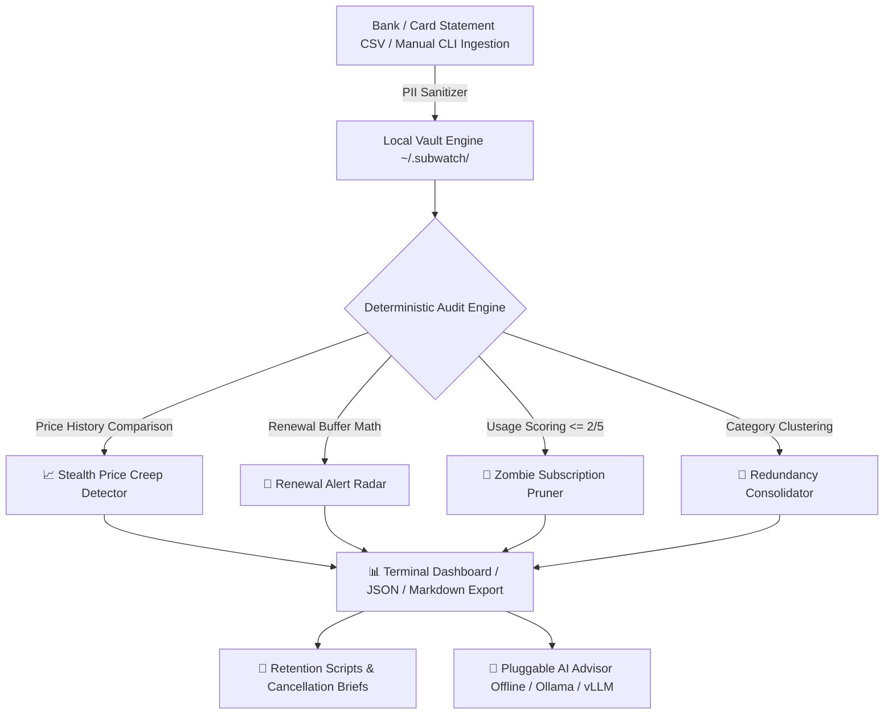

<div align="center">
  <div>&nbsp;</div>
  <h1>🛡️ subwatch-engine</h1>
  <p><strong>Local-First Subscription Price-Creep Auditor, Renewal Alert Radar & Recurring SaaS Optimizer</strong></p>

  [](https://github.com/Muybi3n/AI_Projects/actions)
  [](#)
  [](https://github.com/astral-sh/ruff)
  [](#)
  [](LICENSE)
  [](#)
</div>

---

## 🌟 Overview

**`subwatch-engine`** is a privacy-first, 100% offline subscription intelligence engine and CLI auditor. It solves the widespread friction of **unannounced recurring price hikes (price creep)**, **forgotten free trials auto-converting to annual charges**, **dormant/zombie subscriptions**, and **functional SaaS overlap**.

Unlike cloud aggregators that require storing sensitive bank login credentials or OAuth tokens on third-party servers, `subwatch-engine` runs **entirely on your local machine** (`~/.subwatch/`). It operates deterministically using local rule heuristics, offline mathematical cost modeling, and optional pluggable local LLM adapters (Ollama, local vLLM, or OpenAI-compatible endpoints) with automatic PII sanitization.

---

## ⚡ 30-Second Beginner Quickstart

Run these three commands in your terminal to immediately audit your recurring subscriptions:

```bash
# 1. Clone and navigate to the project
git clone https://github.com/Muybi3n/AI_Projects.git && cd AI_Projects
git checkout subwatch-engine

# 2. Install subwatch locally
pip install -e .

# 3. Add a subscription and run your first price-creep audit
subwatch add --name "Netflix Standard" --price 15.49 --category entertainment --cycle monthly --start-date 2024-01-01 --initial-charge 15.49 --renewal-date 2026-10-25 --usage 4
subwatch log-charge "Netflix Standard" --amount 17.99 --date 2026-10-01
subwatch audit
```

---

## 🏗️ Architecture & Data Flow


```mermaid
graph TD;
    A[Bank / Card Statement CSV / Manual CLI Ingestion] -->|PII Sanitizer| B[Local Vault Engine ~/.subwatch/];
    B --> C{Deterministic Audit Engine};
    C -->|Price History Comparison| D[📈 Stealth Price Creep Detector];
    C -->|Renewal Buffer Math| E[📅 Renewal Alert Radar];
    C -->|Usage Scoring <= 2/5| F[🛑 Zombie Subscription Pruner];
    C -->|Category Clustering| G[🔄 Redundancy Consolidator];
    D --> H[📊 Terminal Dashboard / JSON / Markdown Export];
    E --> H;
    F --> H;
    G --> H;
    H --> I[💬 Retention Scripts & Cancellation Briefs];
    H --> J[🤖 Pluggable AI Advisor Offline / Ollama / vLLM];
```

---

## 🔑 Key Features & Capabilities

1. **📈 Historical Price-Creep & Inflation Detection:**
   - Tracks billing adjustments across time.
   - Detects stealth price hikes (`>= +5.0%` or incremental increases) and computes the true **annualized dollar impact** and cumulative cost expansion.

2. **📅 Renewal Alert Radar & Buffer Protection:**
   - Tracks upcoming auto-renewal dates with customizable cancellation lead-time buffers (e.g. 3–7 days).
   - Classifies urgency tiers: `PAST_DUE`, `CRITICAL` (≤ 3 days), `WARNING` (≤ 7 days), and `UPCOMING` (≤ 30 days).
   - Specifically highlights active trials before billing conversion.

3. **🛑 Zombie & Dormant Subscription Elimination:**
   - Evaluates utility ratings (1–5 scale).
   - Identifies dormant services (usage rating ≤ 2/5) to instantly unlock trapped monthly cash flow.

4. **🔄 Category Redundancy Consolidation:**
   - Detects overlapping subscriptions within identical categories (e.g., multiple streaming platforms, duplicate AI models, redundant cloud hosting tiers).
   - Provides rotation and consolidation playbooks.

5. **💬 SaaS Retention Scripts & Cancellation Briefs:**
   - Generates customized negotiation scripts tailored to support chat/phone representatives referencing initial grandfathered pricing and loyalty tenure.
   - Outputs step-by-step cancellation playbooks with data export and proration checklists.

6. **🔒 100% Local-First & Zero-Credential Architecture:**
   - Zero bank credentials or sensitive account numbers stored.
   - Bank/credit card transaction CSV statement ingestion with built-in regex vendor matching.
   - Automatic regex redaction of payment card tokens (`[CARD_REDACTED]`) and CVV codes.

---

## 📖 Multi-Phase Implementation & Usage Guide

### Phase 1: Adding & Tracking Subscriptions
```bash
# Add a developer tool
subwatch add --name "GitHub Copilot" --price 10.00 --category developer_cloud --cycle monthly --usage 5

# Add an annual subscription with renewal date
subwatch add --name "1Password Family" --price 59.88 --category security --cycle annual --renewal-date 2026-12-15 --usage 5

# Add a trial subscription
subwatch add --name "Streaming Service Trial" --price 9.99 --category entertainment --cycle monthly --status trial --renewal-date 2026-10-12 --notice-days 3
```

### Phase 2: Logging Charges & Auditing Price Creep
```bash
# Record an updated charge to track historical price increases
subwatch log-charge "GitHub Copilot" --amount 14.00 --date 2026-10-01 --notes "Price adjustment"

# Run full portfolio audit
subwatch audit
```

### Phase 3: Upcoming Renewals & Cancellation Radar
```bash
# View all renewals due in the next 30 days
subwatch renewals --days 30

# Generate a retention negotiation script before the renewal date
subwatch brief "Netflix Standard" --negotiate

# Generate a step-by-step cancellation playbook
subwatch brief "Streaming Service Trial"
```

### Phase 4: Ingesting Bank Statement CSVs
```bash
# Preview detected recurring subscriptions from exported credit card / bank statement CSV
subwatch ingest --file statement.csv

# Automatically import detected recurring items into the local vault
subwatch ingest --file statement.csv --auto-add
```

---

## 🤖 Connecting Your Own Local AI / LLM (Ollama, vLLM, OpenAI)

`subwatch-engine` includes a deterministic rule engine that works offline with zero API keys. To connect your own local or cloud LLM, pass a custom Python callable:

```python
from subwatch.advisor import ask_advisor
from subwatch.storage import StorageManager
import requests

# 1. Load your local subscriptions
storage = StorageManager()
subs = storage.load_all()

# 2. Define a 3-line Ollama / local LLM connector
def query_ollama(prompt: str) -> str:
    response = requests.post(
        "http://localhost:11434/api/generate",
        json={"model": "llama3", "prompt": prompt, "stream": False},
        timeout=30,
    )
    return response.json().get("response", "")

# 3. Query your portfolio with AI
advice = ask_advisor(
    "Which redundant developer subscriptions should I consolidate this quarter?",
    subs,
    custom_llm=query_ollama,
)
print(advice)
```

---

## 🔒 Security & Privacy Posture

> **⚠️ NOTE:** This software operates strictly as a local utility. It does not initiate external network connections, collect telemetry, or store banking credentials.

- **Zero Third-Party Telemetry:** All data resides in `~/.subwatch/vault.json` or custom directory.
- **Client-Side PII Scrubbing:** All card and security tokens are stripped prior to passing context to any AI companion adapter.
- **Clean-Room Codebase:** 100% original implementation with zero proprietary snippets.

---

## ⚖️ Limited Liability, Disclaimers & Fair Use

- **Non-Financial / No-Fiduciary Disclaimer:** `subwatch-engine` is an educational and personal productivity utility designed for informational cost tracking and budgeting simulation. It does not provide certified financial, tax, or legal advice, nor does it create a fiduciary or advisor-client relationship.
- **Nominative Fair Use:** All product and company names (e.g., Netflix, Spotify, OpenAI, GitHub, Apple, Google, Chase, Amex, 1Password) are trademarks™ or registered® trademarks of their respective holders. Use of them does not imply any affiliation with, sponsorship by, or endorsement by them.
- **Limitation of Liability & "AS IS" Warranty:** This software is provided under the MIT License on an "AS IS" basis without warranties of any kind. The authors and maintainers assume no liability for calculation inaccuracies, billing discrepancies, missed cancellation deadlines, or financial outcomes.

---

## 📄 License

Distributed under the [MIT License](LICENSE).
