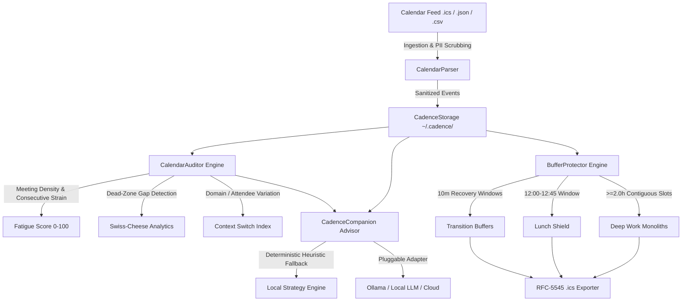

<div align="center">

# 📅 Cadence Calendar (`cadence-calendar`)

**Local-first calendar fatigue auditor, cognitive load analyzer, and deep-work buffer protector engine.**

[](#)
[](LICENSE)
[](#)
[](#)
[](#)
[](#)

> **⚠️ NOTE:** This project is for Proof of Concept (POC) purposes only. It is not intended for production enterprise deployment. No hardcoded credentials or third-party API tokens are stored.

</div>

---

## 📖 Project Overview

Knowledge workers, engineers, and leaders face systemic calendar fragmentation—often termed the **"Swiss-Cheese Calendar"**—where isolated 15-to-30-minute gaps between back-to-back meetings destroy deep focus and accelerate cognitive exhaustion.

**`cadence-calendar`** is an offline, local-first calendar auditor and buffer protector. It ingests industry-standard iCalendar (`.ics`), JSON, and CSV schedules, scrubs sensitive PII, calculates cognitive fatigue scores, flags context-switching friction, and programmatically injects recovery buffers, protected lunch shields, and contiguous 2-to-4 hour deep-work blocks.

### 🔑 Key Capabilities
- **🔒 100% Local-First & Zero-Cloud:** Operates completely offline with local JSON persistence in `~/.cadence/`. Zero calendar credentials or OAuth tokens stored.
- **🛡️ Automated PII Scrubbing:** Strips attendee emails, dial-in phone numbers, and Zoom/meeting passcodes (`pwd=...`) during ingestion prior to any local analysis or LLM querying.
- **📊 Cognitive Fatigue & Burnout Risk Index (0-100):** Evaluates meeting density, consecutive meeting strains (>90m without breaks), out-of-hours creep, and lunch violations into tiered risk levels (`SAFE`, `MODERATE`, `HIGH`, `CRITICAL`).
- **🧀 Swiss-Cheese Fragmentation Detection:** Quantifies unworkable 15–25m dead zones where deep work cannot take place, providing clustering strategies.
- **⚡ Proactive Buffer & Deep-Work Protector:** Computes and inserts 10-minute transition buffers and reserves contiguous 2+ hour focus blocks (`Deep Work / Flow State`), exporting back to standard RFC-5545 `.ics`.
- **🤖 Pluggable AI Scheduling Companion:** Ships with an offline deterministic heuristic advisor plus an optional 3-line adapter for Ollama, vLLM, or OpenAI-compatible models.

---

## 🌟 30-Second Beginner Quickstart

Run these three commands in your terminal to initialize your profile, ingest a calendar, and audit your fatigue:

```bash
# 1. Install cadence-calendar locally
pip install -e .

# 2. Ingest your calendar file (.ics, .json, or .csv) with automatic PII de-identification
cadence ingest ~/Downloads/my_calendar.ics

# 3. Run the fatigue & Swiss-cheese fragmentation audit
cadence audit
```

Expected output:
```text
═══════════════════════════════════════════════════════════════
 📊 CADENCE CALENDAR: FATIGUE & COGNITIVE LOAD AUDIT REPORT 
═══════════════════════════════════════════════════════════════
Total Events:         14 events across 5 active days
Total Meeting Load:   18.5 hrs (Avg: 3.7 hrs/day)
Protected Focus Time: 12.0 hrs
Fragmented Lost Time: 3.5 hrs (Swiss-cheese gaps)
Back-to-Back Chains:  6 back-to-back sequences
Context Switches:     9 domain/attendee context switches
───────────────────────────────────────────────────────────────
Overall Fatigue Score: 68.2/100
Burnout Risk Level:    [HIGH]
───────────────────────────────────────────────────────────────
💡 Strategic Recommendations:
   🛡️ Insert 10-Minute Cognitive Buffers: Found 6 back-to-back meeting sequences.
   🧀 Eliminate Swiss-Cheese Calendar Gaps: 3.5 hrs lost in unworkable 15-25m gaps.
   🚀 Institute 'Focus Friday': Block Friday afternoons (13:00-17:00).
═══════════════════════════════════════════════════════════════
```

---

## 🏗️ Architecture & Data Flow


```mermaid
graph TD
    A[Calendar Feed .ics / .json / .csv] -->|Ingestion & PII Scrubbing| B[CalendarParser]
    B -->|Sanitized Events| C[CadenceStorage ~/.cadence/]
    
    C --> D[CalendarAuditor Engine]
    D -->|Meeting Density & Consecutive Strain| E1[Fatigue Score 0-100]
    D -->|Dead-Zone Gap Detection| E2[Swiss-Cheese Analytics]
    D -->|Domain / Attendee Variation| E3[Context Switch Index]
    
    C --> F[BufferProtector Engine]
    F -->|10m Recovery Windows| G1[Transition Buffers]
    F -->|12:00-12:45 Window| G2[Lunch Shield]
    F -->|>=2.0h Contiguous Slots| G3[Deep Work Monoliths]
    
    G1 & G2 & G3 --> H[RFC-5545 .ics Exporter]
    
    D & C --> I[CadenceCompanion Advisor]
    I -->|Deterministic Heuristic Fallback| J1[Local Strategy Engine]
    I -->|Pluggable Adapter| J2[Ollama / Local LLM / Cloud]
```

---

## 📚 Multi-Phase Deep-Dive Guide

### Phase 1: Profile Initialization & Work Window Guardrails
Set your core working hours, protected lunch duration, and target focus goals:

```bash
cadence init \
  --name "Staff Engineer Schedule" \
  --work-hours "09:00-17:00" \
  --lunch "12:00-12:45" \
  --target-focus 4.0 \
  --max-meetings 3.5 \
  --min-buffer 10
```

### Phase 2: Ingestion with Automated PII Scrubbing
Ingest calendars exported from Google Calendar, Outlook, Apple Calendar, or custom scripts:

```bash
# Ingest with default PII scrub (emails, phone numbers, Zoom passcodes redacted)
cadence ingest /path/to/work_schedule.ics

# Inspect ingested events and time span
cadence stats
```

### Phase 3: Cognitive Fatigue & Swiss-Cheese Audit
Generate daily and weekly metrics to understand meeting load distributions:

```bash
# Standard terminal report
cadence audit

# Filter by date window and output structured JSON for CI / dashboards
cadence audit --from-date 2026-09-01 --to-date 2026-09-30 --json
```

### Phase 4: Proactive Buffer Injection & Deep-Work Shielding
Generate and apply recovery buffers between meetings and reserve 2-hour deep-work blocks:

```bash
# Preview proposed protection blocks
cadence protect --buffer-minutes 10 --min-focus-hours 2.0

# Apply protection blocks directly to local calendar and export to RFC-5545 .ics
cadence protect --buffer-minutes 10 --apply --export protected_calendar.ics
```

Import `protected_calendar.ics` into your calendar client to lock in your focus time and block out meeting encroachers.

---

## 🤖 Connecting Your Own Local AI / LLM (Ollama, vLLM, OpenAI)

`cadence-calendar` is fully functional offline with zero API keys. To connect a local Ollama instance or cloud LLM, pass a lightweight callable to `CadenceCompanion`:

```python
import requests
from cadence_calendar.ai_companion import CadenceCompanion
from cadence_calendar.auditor import CalendarAuditor
from cadence_calendar.storage import CadenceStorage

def ollama_advisor(query: str, context: dict) -> str:
    prompt = f"System: You are an executive calendar auditor.\nContext: {context}\nQuestion: {query}"
    resp = requests.post("http://localhost:11434/api/generate", json={
        "model": "llama3.2",
        "prompt": prompt,
        "stream": False,
    })
    return resp.json()["response"]

storage = CadenceStorage()
events = storage.load_events()
_, wh, _ = storage.load_profile()
audit = CalendarAuditor(work_hours=wh).audit_events(events)

# Instantiate with pluggable adapter
companion = CadenceCompanion(custom_llm_callable=ollama_advisor)
advice = companion.consult("How can I structure next week to get 15 hours of deep coding done?", audit)
print(advice.summary)
```

---

## 🛠️ CLI Reference Table

| Command | Arguments | Description |
|---|---|---|
| `cadence init` | `--work-hours`, `--lunch`, `--target-focus`, `--max-meetings` | Initialize user profile & work window rules |
| `cadence ingest` | `<file>`, `--clear`, `--no-sanitize` | Ingest `.ics`, `.json`, or `.csv` schedule with PII scrubbing |
| `cadence audit` | `--from-date`, `--to-date`, `--json` | Run cognitive fatigue, Swiss-cheese, and context switch audit |
| `cadence protect` | `--buffer-minutes`, `--min-focus-hours`, `--apply`, `--export` | Generate buffer plan, shield lunch, and reserve deep-work |
| `cadence ask` | `"<query>"`, `--json` | Consult the offline AI scheduling advisor |
| `cadence stats` | `--json` | Display summary overview of stored schedule |
| `cadence export` | `-o / --output <path>`, `--cal-name` | Export stored schedule to `.ics` or `.json` |
| `cadence clean` | `--all` | Reset and clear local calendar event store |

---

## 🧪 Testing & Quality Gate

```bash
# Run unit, integration, and full-workflow CLI tests
uv run --with pytest --with pytest-cov pytest --cov=cadence_calendar --cov-report=term-missing tests/

# Run Ruff linter and formatter
uv run --with ruff ruff check src tests
uv run --with ruff ruff format --check src tests
```

---

## ⚖️ Disclaimers, Fair Use & Limitation of Liability

- **Domain Non-Advice Disclaimer:** `cadence-calendar` is an engineering time-management and productivity analysis tool. It does not provide human resources (HR), medical, psychiatric, legal, or organizational occupational health advice. All fatigue scores are heuristic mathematical models.
- **Nominative Fair Use:** All product and company names (e.g., Google Calendar, Microsoft Outlook, Apple Calendar, Zoom, Slack) are trademarks™ or registered® trademarks of their respective holders. Use of them does not imply any affiliation with, sponsorship by, or endorsement by them.
- **Limitation of Liability & "AS IS" Warranty:** This software is provided under the MIT License on an "AS IS" basis, without warranties of any kind. The authors and copyright holders shall not be liable for any missed meetings, scheduling conflicts, or data discrepancies.
- **Clean-Room & Originality Standard:** 100% original clean-room code written with zero proprietary code snippets, leaked credentials, or grey-hat artifacts.

---

## 📄 License

Distributed under the [MIT License](LICENSE). Copyright (c) 2026 bi3n (Muybi3n).
